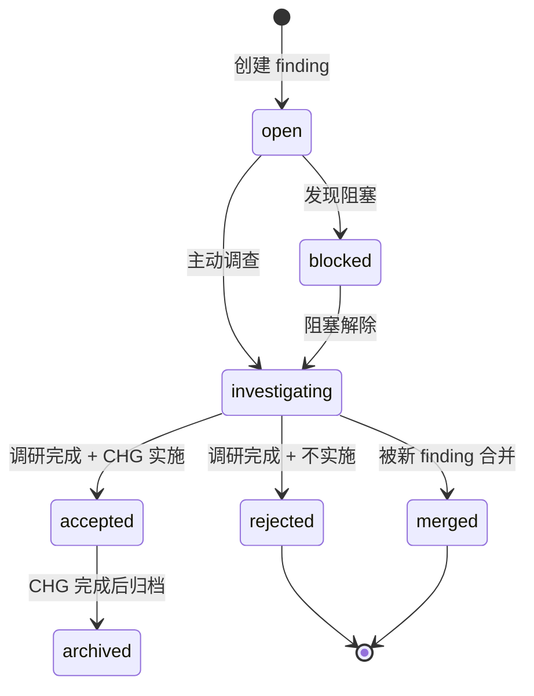

# PACEflow v6.0.0 设计文档

> **文档版本**：1.0
> **生成日期**：2026-05-02
> **状态**：设计中（pre-implementation）
> **关联文档**：`/mnt/k/AI/paceflow-hooks/action-plan-2026-05-02.md`（v6.0.0 提案在第 13-17 节）
> **PoC 验证**：`vault/projects/paceflow-hooks/changes/chg-20260502-01-poc.md`（2026-05-02 完成，节省 73% tokens）
> **历史说明**：本文保留 v6 早期设计背景，包含已废弃的双轨兼容、旧迁移脚本命名等 pre-implementation 决策；当前权威以 `REFERENCE.md`、`README.md`、`plugin/agent-references/**`、`plugin/hooks/**` 为准。

---

## 目录

1. [设计目标与原则](#1-设计目标与原则)
2. [核心架构](#2-核心架构)
3. [数据模型](#3-数据模型)
4. [Frontmatter Schema 规范](#4-frontmatter-schema-规范)
5. [索引文件格式](#5-索引文件格式)
6. [Wikilink 规范与解析](#6-wikilink-规范与解析)
7. [Hook 系统改造](#7-hook-系统改造)
8. [Skill 系统改造](#8-skill-系统改造)
9. [模板系统](#9-模板系统)
10. [迁移工具：migrate-v6.js](#10-迁移工具migrate-v6js)
11. [双轨兼容机制](#11-双轨兼容机制)
12. [测试计划](#12-测试计划)
13. [风险与缓解](#13-风险与缓解)
14. [实施 Phase 拆分](#14-实施-phase-拆分)
15. [回滚方案](#15-回滚方案)
16. [开发者 Checklist](#16-开发者-checklist)

---

## 1. 设计目标与原则

### 1.1 核心目标

**根治长期项目 artifact 膨胀导致的 Edit 循环 token 消耗**——在 ccauth 项目实测：改代码 10K tokens / 写文档归档 100K+ tokens。设计目标：

| 指标 | 当前（v5.1.4） | v6.0.0 目标 |
|------|--------------|-----------|
| 单 CHG 收尾 token 消耗 | 30K-100K+ | < 10K |
| Edit 循环失败率（大文件） | 30-50% | < 5% |
| SessionStart 注入量 | 30-100KB | < 15KB |
| 主 session 写文档时间 | 高 | 低（subagent 分流） |
| 跨 artifact 一致性维护 | 手动 | Obsidian backlinks 自动 |

### 1.2 设计原则

| 原则 | 含义 |
|------|------|
| **单文件原子性** | 一个 CHG/finding/correction 的所有信息集中在单个文件，避免跨文件同步 |
| **索引-详情分离** | 主 artifact 仅含索引，详情在独立文件；索引轻量、详情按需加载 |
| **wikilink 关联** | Obsidian wikilink 作为主要关联机制，backlinks 自动维护 |
| **frontmatter 权威** | 状态/关联/类型存于 frontmatter，索引行只是其展示 |
| **双轨过渡** | v6.0.0 不强制迁移，旧 artifact 保留双区结构，渐进式切换 |
| **subagent 友好** | 单文件小、格式清晰，subagent 即使能力有限也能可靠操作 |
| **零硬编码 ID** | wikilink 解析支持别名/分段（`[[id]]`、`[[id|alias]]`、`[[id#section]]`） |

### 1.3 非目标

- ❌ 不重构 PACE 协议本身（P-A-C-E-V 流程不变）
- ❌ 不替换 Obsidian 作为 vault 工具
- ❌ 不改变 Plugin 安装方式
- ❌ 不改变 Hook 注册机制（hooks.json 仍是入口）
- ❌ 不强制旧 CHG/finding 迁移

---

## 2. 核心架构

### 2.1 完整目录结构

```
projects/<project>/
├── task.md                         索引文件：CHG 任务索引
├── implementation_plan.md          索引文件：CHG 实施索引
├── walkthrough.md                  索引文件：CHG 完成记录索引
├── findings.md                     索引文件：finding 索引 + 摘要
├── corrections.md                  索引文件：correction 索引 ⬅ 新增
├── spec.md                         不变（项目说明）
└── changes/
    ├── chg-20260502-01.md          CHG 详情：包含任务/实施/记录/调研段落
    ├── chg-20260502-02.md
    ├── hotfix-20260321-01.md
    ├── findings/
    │   ├── finding-2026-05-02-v91-126.md
    │   └── finding-2026-04-12-ce-compare.md
    └── corrections/
        ├── correction-2026-04-15-01-archive-skip.md
        └── correction-2026-03-22-01-todowrite-bypass.md
```

### 2.2 文件分类

| 分类 | 数量 | 大小 | 修改频率 |
|------|-----|------|---------|
| **索引文件**（5 个） | 5 | 3-15KB | 高（每个 CHG 涉及） |
| **CHG 详情** | N | 1-5KB | 中（CHG 进行时） |
| **finding 详情** | N | 2-10KB | 低（写一次为主） |
| **correction 详情** | N | 1-3KB | 极低（一次性记录） |
| **spec.md** | 1 | 2-10KB | 极低（项目稳定后不变） |

### 2.3 数据流

```
新 CHG 启动
  └─ 主 session 派 subagent
      ├─ Write changes/chg-yyyymmdd-nn.md（含完整内容）
      ├─ Edit task.md 添加索引行 [[chg-xxx]]
      ├─ Edit implementation_plan.md 添加索引行
      └─ 主 session 接收"已创建 CHG-xxx"报告

CHG 进行中
  └─ 主 session 派 subagent 修改详情
      └─ Edit changes/chg-xxx.md（小文件，命中率高）

CHG 完成
  └─ 主 session 派 subagent 归档
      ├─ Edit changes/chg-xxx.md frontmatter status: completed
      ├─ Edit task.md 索引行 [/]→[x] 移到 ARCHIVE 下方
      ├─ Edit implementation_plan.md 同上
      └─ Edit walkthrough.md 添加完成索引行
```

---

## 3. 数据模型

### 3.1 实体关系图

```
spec  ─────  project description (1 per project)

CHG ──┬── related-finding ──→ finding
      ├── parent-tasks ──→ task.md (index)
      └── parent-impl ──→ implementation_plan.md (index)

finding ──┬── related-changes ──→ CHG (N:N)
          ├── merges ──→ finding (history chain)
          └── merged-by ──→ finding (history chain)

correction ──── knowledge-link ──→ knowledge note
              └── related-finding ──→ finding (optional)
```

### 3.2 ID 命名规范

| 类型 | 格式 | 文件名 | wikilink |
|------|------|-------|---------|
| CHG | `CHG-YYYYMMDD-NN` | `chg-yyyymmdd-nn.md` | `[[chg-yyyymmdd-nn]]` |
| HOTFIX | `HOTFIX-YYYYMMDD-NN` | `hotfix-yyyymmdd-nn.md` | `[[hotfix-yyyymmdd-nn]]` |
| FINDING | `FINDING-YYYY-MM-DD-slug` | `finding-yyyy-mm-dd-slug.md` | `[[finding-yyyy-mm-dd-slug]]` |
| CORRECTION | `CORRECTION-YYYY-MM-DD-NN` | `correction-yyyy-mm-dd-nn-slug.md` | `[[correction-yyyy-mm-dd-nn-slug]]` |

**slug 规则**：
- 小写
- 仅字母/数字/连字符
- 长度 ≤ 30 字符
- 由 ID 自动生成（基于标题前 5-7 个有意义词）

**示例**：
- 标题："hooks.json `if` 条件优化" → slug："hooks-json-if"
- 标题："CC v2.1.91→v2.1.126 完整变更评估" → slug："v91-126"

### 3.3 状态机

#### 3.3.1 CHG 状态机

```
       ┌──────────────────────────────────┐
       v                                  │
  [planned] ──C阶段批准──> [in-progress] ──任务完成──> [completed] ──归档──> [archived]
       │                       │
       └──────放弃──────────────┴──> [cancelled]
```

frontmatter 映射：
- `status: planned` → 索引 `[ ]`
- `status: in-progress` → 索引 `[/]`
- `status: completed` → 索引 `[x]`（活跃区）
- `status: archived` → 索引 `[x]`（ARCHIVE 下方）
- `status: cancelled` → 索引 `[-]`（ARCHIVE 下方）

#### 3.3.2 finding 状态机

```
  [open] ──主动调查──> [investigating] ──结论──┬──> [accepted] ──CHG完成──> [archived]
                                              ├──> [rejected]（≥10字符理由）
                                              └──> [merged]（指向新 finding）

  [open] ──发现阻塞──> [blocked]
```

frontmatter status 映射：
- `open` → `[ ]`
- `investigating` → `[/]`
- `accepted` → `[x]`
- `rejected` → `[-]`（必须 rejection-reason ≥10 字符）
- `merged` → `[-]`（必须 merged-into wikilink）
- `blocked` → `[!]`

#### 3.3.3 correction 状态机

correction 是单一状态：`recorded`（记录即终态），不归档（永久参考）。

---

## 4. Frontmatter Schema 规范

### 4.1 CHG/HOTFIX Schema

```yaml
---
# 必填
chg-id: CHG-20260502-01           # 大写 ID，与文件名映射（chg-20260502-01.md）
status: in-progress                # planned | in-progress | completed | archived | cancelled
date: 2026-05-02                   # 创建日期（ISO 8601 date）
type: change                       # change | hotfix | research

# 关联（必填，可空数组）
parent-tasks: ["[[task]]"]
parent-impl: ["[[implementation_plan]]"]

# 可选
related-finding: "[[finding-2026-05-02-v91-126]]"   # 关联的源调研
aliases: ["CHG-20260502-01", "hooks.json if 优化"]   # Obsidian wikilink 别名
tags: [change, hooks-optimization]                   # Obsidian 标签
completed-date: null               # status=completed 时填，ISO 8601 datetime
archived-date: null                # status=archived 时填

# v6.0.0 内部字段
schema-version: "6.0"
---
```

### 4.2 finding Schema

```yaml
---
# 必填
finding-id: FINDING-2026-05-02-v91-126
status: open                       # open | investigating | accepted | rejected | merged | blocked
type: research                     # research | observation | comparison | bug-report
date: 2026-05-02
impact: P1                         # P0 | P1 | P2 | P3
summary: "CC v2.1.91→126 共 35 版本：5 项关键发现"   # ≤ 200 字符

# 关联（可选）
related-changes: ["[[chg-20260502-01]]", "[[chg-20260502-02]]"]
merges: ["[[finding-2026-04-02-v76-90]]"]    # 该 finding 替代了哪些
merged-by: null                              # 该 finding 被哪个替代

# 状态相关（条件必填）
rejection-reason: null             # status=rejected 时必填，≥10 字符
investigation-started: null        # status=investigating 时填，ISO 8601 datetime
accepted-date: null                # status=accepted 时填
accepted-by: "[[chg-20260502-01]]"  # status=accepted 时填，关联实施 CHG

# 可选
aliases: ["v91-126 调研"]
tags: [finding, research, claude-code-changelog]

# v6.0.0 内部字段
schema-version: "6.0"
---
```

### 4.3 correction Schema

```yaml
---
# 必填
correction-id: CORRECTION-2026-04-15-01
date: 2026-04-15

# 内容（必填）
trigger-quote: "用户原话或近似引用"
wrong-behavior: "AI 错误行为简述"   # ≥ 20 字符
correct-behavior: "正确做法简述"     # ≥ 20 字符
trigger-scenario: "什么场景下容易出现"
root-cause: "根本原因（认知偏差 / 工具限制 / 流程缺失）"

# knowledge 双写（必填，二选一）
knowledge-link: "[[ai-verification-discipline]]"   # knowledge/ 笔记 wikilink
project-scope: "project-only"                      # 或填 "project-only" 表示仅本项目

# 可选
related-finding: null              # 如有
aliases: []
tags: [correction, knowledge-discipline]

# v6.0.0 内部字段
schema-version: "6.0"
---
```

### 4.4 Schema 校验规则（hook 实施）

```javascript
// pace-utils.js 新增
function validateChgFrontmatter(fm) {
  const errors = [];
  if (!fm['chg-id']?.match(/^(CHG|HOTFIX)-\d{8}-\d{2}$/)) {
    errors.push('chg-id 格式错误，应为 CHG-YYYYMMDD-NN 或 HOTFIX-YYYYMMDD-NN');
  }
  if (!['planned', 'in-progress', 'completed', 'archived', 'cancelled'].includes(fm.status)) {
    errors.push('status 字段值非法');
  }
  if (fm.status === 'completed' && !fm['completed-date']) {
    errors.push('status=completed 必须填 completed-date');
  }
  // ... 其他规则
  return errors;
}

function validateFindingFrontmatter(fm) {
  const errors = [];
  if (!fm['finding-id']?.match(/^FINDING-\d{4}-\d{2}-\d{2}-[\w-]+$/)) {
    errors.push('finding-id 格式错误');
  }
  if (fm.status === 'rejected' && (!fm['rejection-reason'] || fm['rejection-reason'].length < 10)) {
    errors.push('status=rejected 必须填 rejection-reason ≥ 10 字符');
  }
  if (fm.status === 'merged' && !fm['merged-by']) {
    errors.push('status=merged 必须填 merged-by wikilink');
  }
  if (!fm.summary || fm.summary.length > 200) {
    errors.push('summary 必须 ≤ 200 字符');
  }
  return errors;
}

function validateCorrectionFrontmatter(fm) {
  const errors = [];
  if (!fm['wrong-behavior'] || fm['wrong-behavior'].length < 20) {
    errors.push('wrong-behavior 必须 ≥ 20 字符');
  }
  if (!fm['knowledge-link'] && fm['project-scope'] !== 'project-only') {
    errors.push('knowledge-link 必填，或 project-scope=project-only');
  }
  return errors;
}
```

---

## 5. 索引文件格式

### 5.1 task.md（CHG 任务索引）

```markdown
# 项目任务追踪

## 活跃任务

- [/] [[chg-20260502-02]] PreCompact 阻止能力 #change [tasks:: T-501~T-505]
- [/] [[chg-20260502-01]] hooks.json `if` 条件优化 #change [tasks:: T-498~T-500]

<!-- ARCHIVE -->

- [x] [[chg-20260403-01]] SKILL.md 元数据修正 #change [tasks:: T-498]
- [x] [[chg-20260321-01]] v5.1.4 code review 修复 #change [tasks:: T-497]
- [x] [[chg-20260319-01]] Superpowers v5.0.0+ 路径兼容 #change [tasks:: T-491-T-496]
```

**字段说明**：
- 索引行格式：`- [状态] [[wikilink]] 标题 #标签 [元数据::]`
- `[tasks:: T-NNN~T-NNN]` 表示该 CHG 包含的任务编号范围
- 子任务的具体状态在详情文件 `## 任务清单` 段中

### 5.2 implementation_plan.md（CHG 实施索引）

```markdown
# 实施计划

> **最后更新**: 2026-05-02T15:00:00+08:00

## 变更索引

<!-- 格式：- [状态] [[wikilink]] 标题 #change [tasks::] -->

- [/] [[chg-20260502-02]] PreCompact 阻止能力 #change [tasks:: T-501~T-505]
- [/] [[chg-20260502-01]] hooks.json `if` 条件优化 #change [tasks:: T-498~T-500]

<!-- ARCHIVE -->

- [x] [[chg-20260403-01]] SKILL.md 元数据修正 #change
- ...
```

**与当前架构差异**：不再有"活跃变更详情"区，详情在 `changes/chg-xxx.md`。

### 5.3 walkthrough.md（CHG 完成记录索引）

```markdown
# 工作记录

## 最近工作

| 日期 | 完成内容 | 关联变更 |
| --- | --- | --- |
| 2026-05-02 | [[chg-20260502-01]] hooks.json if 条件（T-498-T-500） | CHG-20260502-01 |
| 2026-04-03 | [[chg-20260403-01]] SKILL.md 元数据修正（T-498 description+effort） | CHG-20260403-01 |

<!-- ARCHIVE -->

| 2026-03-21 | [[hotfix-20260321-01]] v5.1.4 code review 修复 | HOTFIX-20260321-01 |
| ... |
```

**与当前架构差异**：不再有"详细记录"段（详情在 chg-xxx.md 的 `## 工作记录` 段）。

### 5.4 findings.md（finding 索引）

```markdown
# 调研记录

## 摘要索引

<!-- 格式：- [状态] [[finding-id]] 标题 — summary [元数据::] -->

- [ ] [[finding-2026-05-02-v91-126]] CC v2.1.91→126 — 35 版本，5 关键发现 [date:: 2026-05-02] [impact:: P1] [merges:: [[finding-2026-04-02-v76-90]]]
- [-] [[finding-2026-04-12-ce-compare]] CE Plugin 对比 — 可共存 [date:: 2026-04-12] [impact:: P3]
- [-] [[finding-2026-04-02-v76-90]] CC v2.1.76→90 — 已合并 [date:: 2026-04-02] [merged-into:: [[finding-2026-05-02-v91-126]]]

<!-- ARCHIVE -->

- [x] [[finding-2026-03-12-ticket22]] v5.0.2 全面审查 [date:: 2026-03-12] [change:: [[chg-20260312-04]]]
- ...
```

**与当前架构差异**：
- 索引行从 200-500 字符缩到 50-100 字符
- 不再有 `## 未解决问题` 区（详情在 changes/findings/）
- 不再有 `## Corrections 记录` 区（移到 corrections.md）

### 5.5 corrections.md（correction 索引）⬅ 新增文件

```markdown
# Corrections 记录

> AI 行为纠正历史。每条 correction 必双写到 knowledge/ 或标 project-only。

## 索引

<!-- 格式：- [[correction-id]] 简要标题 [date::] [knowledge::] [scope::] -->

- [[correction-2026-04-15-01-archive-skip]] 任务完成后未主动归档 [date:: 2026-04-15] [knowledge:: project-only]
- [[correction-2026-03-22-01-todowrite-bypass]] TodoWrite 使用前未先 read task [date:: 2026-03-22] [knowledge:: [[ai-verification-discipline]]]

<!-- ARCHIVE -->

（更老 corrections 索引）
```

---

## 6. Wikilink 规范与解析

### 6.1 支持的 wikilink 形式

| 形式 | 含义 | 解析为 |
|------|------|-------|
| `[[chg-20260502-01]]` | 直接引用 | id="chg-20260502-01" |
| `[[chg-20260502-01\|hooks.json 优化]]` | 带别名 | id + alias |
| `[[chg-20260502-01#实施详情]]` | 引用片段 | id + section |
| `[[chg-20260502-01#实施详情\|实施]]` | 片段+别名 | id + section + alias |

### 6.2 解析正则（pace-utils.js 新增）

```javascript
// pace-utils.js
const WIKILINK_RE = /\[\[([^\]\|#]+)(?:#([^\]\|]+))?(?:\|([^\]]+))?\]\]/g;

function parseWikilinks(text) {
  const results = [];
  let match;
  while ((match = WIKILINK_RE.exec(text)) !== null) {
    results.push({
      id: match[1],          // chg-20260502-01
      section: match[2] || null,  // 实施详情
      alias: match[3] || null,    // 实施
      raw: match[0]          // [[chg-20260502-01#实施详情|实施]]
    });
  }
  return results;
}

function buildWikilink(id, opts = {}) {
  let link = `[[${id}`;
  if (opts.section) link += `#${opts.section}`;
  if (opts.alias) link += `|${opts.alias}`;
  link += `]]`;
  return link;
}

// 从 wikilink id 解析详情文件路径
function resolveWikilinkPath(cwd, id) {
  const idLower = id.toLowerCase();
  if (idLower.startsWith('chg-') || idLower.startsWith('hotfix-')) {
    return path.join(getArtifactDir(cwd), 'changes', `${idLower}.md`);
  }
  if (idLower.startsWith('finding-')) {
    return path.join(getArtifactDir(cwd), 'changes', 'findings', `${idLower}.md`);
  }
  if (idLower.startsWith('correction-')) {
    return path.join(getArtifactDir(cwd), 'changes', 'corrections', `${idLower}.md`);
  }
  return null;  // 不识别
}
```

### 6.3 完整性检查（hook 实施）

```javascript
// post-tool-use.js 新增逻辑
function checkWikilinkIntegrity(cwd, file) {
  const content = fs.readFileSync(file, 'utf8');
  const links = parseWikilinks(content);
  const broken = [];
  for (const link of links) {
    const targetPath = resolveWikilinkPath(cwd, link.id);
    if (targetPath && !fs.existsSync(targetPath)) {
      broken.push({ id: link.id, raw: link.raw });
    }
  }
  return broken;
}
```

---

## 7. Hook 系统改造

### 7.1 总体改造原则

- 保持 hook 注册机制不变（`hooks.json`）
- 保持 stdin/stdout/exit code 协议不变
- pace-utils.js 新增 v6.0.0 工具函数，旧函数保留向后兼容
- 双轨支持：hook 自动检测 v5.x（双区结构）vs v6.0（索引-详情）

### 7.2 pace-utils.js 新增函数

```javascript
// === v6.0.0 新增 ===

/**
 * 检测项目是否为 v6.0.0 结构（基于 changes/ 目录存在）
 */
function isV6Project(cwd) {
  const changesDir = path.join(getArtifactDir(cwd), 'changes');
  return fs.existsSync(changesDir);
}

/**
 * 列出所有 CHG 详情文件
 */
function listChgFiles(cwd) {
  const changesDir = path.join(getArtifactDir(cwd), 'changes');
  if (!fs.existsSync(changesDir)) return [];
  return fs.readdirSync(changesDir)
    .filter(f => /^(chg|hotfix)-\d{8}-\d{2}\.md$/.test(f))
    .map(f => path.join(changesDir, f));
}

/**
 * 列出所有 finding 详情文件
 */
function listFindingFiles(cwd) {
  const findingsDir = path.join(getArtifactDir(cwd), 'changes', 'findings');
  if (!fs.existsSync(findingsDir)) return [];
  return fs.readdirSync(findingsDir)
    .filter(f => /^finding-\d{4}-\d{2}-\d{2}-[\w-]+\.md$/.test(f))
    .map(f => path.join(findingsDir, f));
}

/**
 * 列出所有 correction 详情文件
 */
function listCorrectionFiles(cwd) {
  const correctionsDir = path.join(getArtifactDir(cwd), 'changes', 'corrections');
  if (!fs.existsSync(correctionsDir)) return [];
  return fs.readdirSync(correctionsDir)
    .filter(f => /^correction-\d{4}-\d{2}-\d{2}-\d{2}-[\w-]+\.md$/.test(f))
    .map(f => path.join(correctionsDir, f));
}

/**
 * 解析 frontmatter
 */
function parseFrontmatter(content) {
  const match = content.match(/^---\n([\s\S]+?)\n---\n/);
  if (!match) return null;
  // 简化 YAML 解析，建议引入 js-yaml
  // ...
  return parsed;
}

/**
 * 读取详情文件并返回 frontmatter + body
 */
function readDetailFile(filePath) {
  if (!fs.existsSync(filePath)) return null;
  const content = fs.readFileSync(filePath, 'utf8');
  const fm = parseFrontmatter(content);
  const body = content.replace(/^---\n[\s\S]+?\n---\n/, '');
  return { frontmatter: fm, body, content };
}

/**
 * 按 status 过滤 CHG/finding 详情
 */
function filterDetailsByStatus(files, status) {
  return files
    .map(f => ({ path: f, ...readDetailFile(f) }))
    .filter(d => d.frontmatter?.status === status);
}

/**
 * Wikilink 完整性检查
 */
function checkAllWikilinks(cwd) {
  const indexFiles = ARTIFACT_FILES.map(f => path.join(getArtifactDir(cwd), f));
  const broken = [];
  for (const indexFile of indexFiles) {
    if (!fs.existsSync(indexFile)) continue;
    const links = parseWikilinks(fs.readFileSync(indexFile, 'utf8'));
    for (const link of links) {
      const targetPath = resolveWikilinkPath(cwd, link.id);
      if (targetPath && !fs.existsSync(targetPath)) {
        broken.push({ from: indexFile, ...link });
      }
    }
  }
  return broken;
}
```

### 7.3 各 hook 改造点

#### 7.3.1 session-start.js

| 改动 | 说明 |
|------|------|
| 注入活跃区 | `readActive()` 返回内容更小（仅索引行），但需 enrich：对每个 wikilink 提取详情文件的 summary 字段 |
| 模板懒创建 | v6.0.0 时创建 `changes/`、`changes/findings/`、`changes/corrections/` + corrections.md |
| compact 恢复 | 注入 v6.0.0 提示：详情在 `changes/` 下，主索引在 5 个 .md 文件 |

伪代码：
```javascript
// session-start.js 新增 enrichIndex
function enrichIndexWithSummaries(cwd, indexContent) {
  const links = parseWikilinks(indexContent);
  const enrichments = [];
  for (const link of links) {
    const detail = readDetailFile(resolveWikilinkPath(cwd, link.id));
    if (detail?.frontmatter?.summary) {
      enrichments.push(`- ${link.id}: ${detail.frontmatter.summary}`);
    }
  }
  return indexContent + '\n\n## 详情摘要（hook 自动注入）\n' + enrichments.join('\n');
}
```

#### 7.3.2 pre-tool-use.js

| 改动 | 说明 |
|------|------|
| 三级触发判断 | 增加 `isV6Project()` 分支：v6.0.0 项目下 Write/Edit `changes/*.md` 不视为 artifact 修改（无 ARCHIVE 检查） |
| C 阶段批准 | 检查索引文件的 APPROVED 标记位置，详情文件 frontmatter `status: planned` |
| Write 保护 | v6.0.0 不再禁止 Write `implementation_plan.md` 等（因为是索引文件，可重写） |

#### 7.3.3 post-tool-use.js

| 改动 | 说明 |
|------|------|
| 归档提醒 | 检测主索引行变更（`[/]` → `[x]`）后提醒同步详情 frontmatter `status: completed` |
| Wikilink 完整性 | Edit 索引文件后检查所有 wikilink 是否指向有效文件，broken 链接列表注入 additionalContext |
| frontmatter schema 校验 | Write/Edit `changes/*.md` 后验证 frontmatter 符合 Schema |

#### 7.3.4 stop.js

| 改动 | 说明 |
|------|------|
| 14 天阻止 | 基于 finding 详情 frontmatter `date` 字段而非索引行（更精确） |
| `[ ]` 状态过滤 | 排除 `status: investigating` 的 finding（主动调查中不阻止） |
| 详情完整性 | CHG 标 [x] 但 changes/chg-xxx.md 不存在 → 阻止 |
| 跨 artifact 一致性 | task.md 和 impl_plan.md 索引应包含相同 CHG-ID 集合 |

#### 7.3.5 todowrite-sync.js

| 改动 | 说明 |
|------|------|
| 任务源 | 从 task.md 索引行 + 详情文件 `## 任务清单` 段读取 |
| 一致性检查 | TodoWrite 任务必须能映射到某个 CHG 详情文件的子任务 |

#### 7.3.6 pre-compact.js

| 改动 | 说明 |
|------|------|
| snapshot 内容 | 包含活跃 CHG 列表（按索引行 + 详情 status 综合判断） |
| 阻止逻辑 | 集成 action-plan CHG-20260502-02（PreCompact 阻止能力） |

#### 7.3.7 config-guard.js

无改动（与 v6.0.0 解耦）。

#### 7.3.8 stop-failure.js

无改动。

### 7.4 ARTIFACT_FILES 常量更新

```javascript
// pace-utils.js
const ARTIFACT_FILES_V5 = [
  'spec.md', 'task.md', 'implementation_plan.md', 'walkthrough.md', 'findings.md'
];
const ARTIFACT_FILES_V6 = [
  ...ARTIFACT_FILES_V5,
  'corrections.md'  // 新增
];

// hook 内根据 isV6Project() 选择
function getArtifactFiles(cwd) {
  return isV6Project(cwd) ? ARTIFACT_FILES_V6 : ARTIFACT_FILES_V5;
}
```

---

## 8. Skill 系统改造

### 8.1 5 个 SKILL.md 改造点

| Skill | 改造点 |
|-------|-------|
| **pace-workflow** | A 阶段：引导先 Write `changes/chg-xxx.md` 再 Edit 索引；E 阶段：详情修改在 changes/chg-xxx.md，索引同步 |
| **pace-bridge** | 桥接到新结构：检测 docs/plans/ 时建议生成 `changes/chg-xxx.md` |
| **artifact-management** | 全面重写：v6.0.0 索引-详情拆分规则、wikilink 规范、frontmatter schema、归档新流程 |
| **pace-knowledge** | finding/correction 的 knowledge 双写规则不变；新增 changes/findings/ 路径 |
| **paceflow-audit** | 审计范围扩展到 changes/ 子目录的所有详情文件 |

### 8.2 artifact-management/SKILL.md 重写要点

```markdown
---
name: artifact-management
description: |
  v6.0.0 索引-详情拆分架构下的 artifact 文件管理。索引文件（task/impl_plan/walkthrough/findings/corrections.md）
  仅含索引行，详情存于 changes/ 子目录。CHG-ID 通过 wikilink [[chg-xxx]] 关联。当创建或编辑任何 artifact
  文件时自动激活。
effort: medium
---

# Artifact Management v6.0.0

## 核心规则

1. **创建新 CHG**：先 Write `changes/chg-yyyymmdd-nn.md`，再 Edit 主索引追加 wikilink 行
2. **修改进行中 CHG**：仅 Edit `changes/chg-xxx.md`，主索引不动（除非状态变化）
3. **CHG 完成归档**：(a) Edit 详情 frontmatter status: completed (b) 移动主索引行到 ARCHIVE 下方
4. **跨 artifact 一致性**：1 个 CHG 在 task / impl_plan / walkthrough 三个索引文件出现，wikilink 指向同一详情文件

## Frontmatter Schema

[详细 schema 规范]

## Wikilink 规范

[详细 wikilink 规范]

## 子任务管理

[详细子任务规范]
```

### 8.3 references/ 目录新增

```
skills/artifact-management/references/
├── format-reference-v6.md          # v6.0.0 格式权威源
├── change-lifecycle-v6.md          # v6.0.0 CHG 生命周期
├── wikilink-syntax.md              # wikilink 语法详解
├── frontmatter-schema.md           # frontmatter 完整 schema
└── migration-from-v5.md            # 旧 artifact 迁移指南
```

---

## 9. 模板系统

### 9.1 模板文件清单

```
hooks/templates/
├── task.md                         索引模板（仅活跃任务空区 + ARCHIVE 标记）
├── implementation_plan.md          索引模板（变更索引空区 + ARCHIVE 标记）
├── walkthrough.md                  索引模板（最近工作空表 + ARCHIVE 标记）
├── findings.md                     索引模板（摘要索引空区 + ARCHIVE 标记）
├── corrections.md                  ⬅ 新增：corrections 索引模板
├── spec.md                         不变
├── chg-template.md                 ⬅ 新增：CHG 详情模板
├── finding-template.md             ⬅ 新增：finding 详情模板
└── correction-template.md          ⬅ 新增：correction 详情模板
```

### 9.2 chg-template.md

```markdown
---
chg-id: CHG-{{DATE}}-{{NN}}
status: planned
date: {{DATE}}
type: change
parent-tasks: ["[[task]]"]
parent-impl: ["[[implementation_plan]]"]
related-finding: null
aliases: []
tags: [change]
schema-version: "6.0"
---

# {{TITLE}}

## 任务清单

- [ ] T-{{N}} {{任务描述}}

<!-- APPROVED -->

## 实施详情

**背景（Why）**：{{为什么要做}}

**范围（What）**：{{改什么}}

**技术决策（How）**：{{怎么做}}

**T-{{N}} 任务标题**：
- 具体改动说明

## 工作记录

| 日期 | 完成内容 |
| --- | --- |

## 关联调研

（如有相关 finding，列 wikilink）
```

### 9.3 finding-template.md

```markdown
---
finding-id: FINDING-{{DATE}}-{{SLUG}}
status: open
type: research
date: {{DATE}}
impact: P{{0-3}}
summary: "{{一句话摘要 ≤ 200 字符}}"
related-changes: []
merges: []
merged-by: null
rejection-reason: null
aliases: []
tags: [finding]
schema-version: "6.0"
---

# {{TITLE}}

## 摘要

> {{详细摘要}}

## 背景

{{触发调研的原因}}

## 关键发现

{{发现内容}}

## 不确定项

（如有）

## 建议方案

{{推荐做法}}

## 调研来源

{{链接列表}}
```

### 9.4 correction-template.md

```markdown
---
correction-id: CORRECTION-{{DATE}}-{{NN}}
date: {{DATE}}
trigger-quote: "{{用户原话}}"
wrong-behavior: "{{错误行为}}"
correct-behavior: "{{正确做法}}"
trigger-scenario: "{{触发场景}}"
root-cause: "{{根本原因}}"
knowledge-link: null
project-scope: project-only
related-finding: null
aliases: []
tags: [correction]
schema-version: "6.0"
---

# Correction: {{TITLE}}

## 错误行为

{{详细描述}}

## 正确做法

{{详细描述}}

## 触发场景

{{具体场景}}

## 根本原因

{{认知层面分析}}

## 关联知识

- [[{{knowledge-note}}]]（如适用）
```

---

## 10. 迁移工具：migrate-v6.js

### 10.1 工具职责

将 v5.x 双区结构 artifact 迁移到 v6.0.0 索引-详情结构。

### 10.2 命令行接口

```bash
# 干运行（不修改文件，仅输出迁移计划）
node migrate-v6.js --project /path/to/project --dry-run

# 仅迁移 finding（最稳定，先做）
node migrate-v6.js --project /path/to/project --only findings

# 仅迁移 correction
node migrate-v6.js --project /path/to/project --only corrections

# 仅迁移 CHG（需要 4 文件协同，最复杂）
node migrate-v6.js --project /path/to/project --only changes

# 全部迁移
node migrate-v6.js --project /path/to/project --all

# 回滚（基于 .pace/migration-backup/ 还原）
node migrate-v6.js --project /path/to/project --rollback
```

### 10.3 迁移算法（finding 示例）

```javascript
function migrateFindings(projectPath) {
  const findingsPath = path.join(projectPath, 'findings.md');
  const content = fs.readFileSync(findingsPath, 'utf8');

  // 1. 备份
  backupFile(findingsPath);

  // 2. 拆分活跃区和归档区
  const [active, archive] = splitOnArchiveMarker(content);

  // 3. 解析摘要索引行（提取状态/日期/标题/关联CHG）
  const indexEntries = parseFindingIndex(active);

  // 4. 解析 ## 未解决问题 区的详情段落
  const detailSections = parseFindingDetails(active);

  // 5. 解析归档区详情段落
  const archiveDetailSections = parseFindingDetails(archive);

  // 6. 合并索引和详情，生成详情文件
  const allDetails = [...detailSections, ...archiveDetailSections];
  const newFindings = [];
  for (const entry of indexEntries) {
    const detail = matchDetail(entry, allDetails);
    const findingFile = generateFindingFile(entry, detail);
    newFindings.push(findingFile);
  }

  // 7. 写入 changes/findings/ 子目录
  for (const f of newFindings) {
    fs.writeFileSync(
      path.join(projectPath, 'changes/findings', f.filename),
      f.content
    );
  }

  // 8. 重写 findings.md 为 v6.0.0 索引
  const newIndex = generateNewIndex(indexEntries);
  fs.writeFileSync(findingsPath, newIndex);

  return { migrated: newFindings.length };
}
```

### 10.4 备份机制

```
projects/<project>/.pace/migration-backup/
├── 2026-05-15-v6-migration/
│   ├── findings.md.bak
│   ├── implementation_plan.md.bak
│   ├── task.md.bak
│   ├── walkthrough.md.bak
│   └── manifest.json     # 记录迁移内容、时间、版本
```

### 10.5 验收检查

```bash
# 迁移后自动检查
node migrate-v6.js --project /path/to/project --verify

# 检查项：
# 1. 索引行数量 = 详情文件数量
# 2. 每个 wikilink 指向的文件都存在
# 3. frontmatter schema 校验通过
# 4. 主索引文件大小 < 15KB
```

---

## 11. 双轨兼容机制

### 11.1 项目类型检测

```javascript
function detectProjectVersion(cwd) {
  const changesDir = path.join(getArtifactDir(cwd), 'changes');
  if (fs.existsSync(changesDir) && fs.readdirSync(changesDir).length > 0) {
    return 'v6';
  }
  // 旧项目（5 个 artifact 文件，无 changes/ 目录）
  return 'v5';
}
```

### 11.2 hook 兼容策略

每个 hook 在入口检测项目版本，分支处理：

```javascript
// pre-tool-use.js 入口
const version = detectProjectVersion(cwd);
if (version === 'v6') {
  return handleV6PreToolUse(cwd, stdin);
} else {
  return handleV5PreToolUse(cwd, stdin);  // 现有逻辑
}
```

### 11.3 渐进迁移路径

| 时间点 | 状态 |
|-------|------|
| v6.0.0 发布 | 双轨支持，新项目默认 v6.0，旧项目保留 v5 |
| v6.1.0 | 提供 migrate-v6.js，用户主动迁移 |
| v6.5.0 | 检测旧项目时给出迁移提醒（不强制） |
| v7.0.0 | 评估是否废弃 v5 兼容代码（需 90%+ 项目迁移） |

---

## 12. 测试计划

### 12.1 单元测试

针对 pace-utils.js 新增函数：

```javascript
// test-pace-utils-v6.js
describe('parseWikilinks', () => {
  test('basic [[id]]', () => { ... });
  test('with section [[id#section]]', () => { ... });
  test('with alias [[id|alias]]', () => { ... });
  test('section + alias [[id#section|alias]]', () => { ... });
});

describe('parseFrontmatter', () => {
  test('valid yaml', () => { ... });
  test('missing ---', () => { ... });
  test('special chars in values', () => { ... });
});

describe('validateChgFrontmatter', () => {
  test('valid', () => { ... });
  test('invalid chg-id format', () => { ... });
  test('status=completed without completed-date', () => { ... });
});

// 覆盖率目标：> 90%
```

### 12.2 集成测试

完整流程测试：

```bash
# tests/test-v6-e2e.js
1. 创建空 v6.0.0 项目
2. 主 session 模拟创建 CHG（Write changes/chg-xxx.md + Edit 索引）
3. 验证 hook 反馈
4. 模拟修改详情
5. 模拟完成归档
6. 验证文件状态一致性
7. 验证 wikilink 完整性
```

### 12.3 dogfood 计划

| 阶段 | 项目 | 目标 |
|------|-----|------|
| Alpha | PACEflow 自身 | 主开发者使用 1 周，记录痛点 |
| Beta | ccauth 项目（手动迁移） | 验证 95% token 节省 |
| RC | 5 个外部项目（自愿） | 收集反馈 |
| GA | 全面发布 | v6.0.0 正式可用 |

### 12.4 性能基准测试

```bash
# 测量 token 消耗
node tests/benchmark-v6.js --scenario chg-create
node tests/benchmark-v6.js --scenario chg-archive
node tests/benchmark-v6.js --scenario finding-write
```

预期结果：
- chg-create：v6 < 5K tokens / v5 ~30K tokens
- chg-archive：v6 < 3K tokens / v5 ~50K tokens
- finding-write：v6 < 4K tokens / v5 ~25K tokens

---

## 13. 风险与缓解

### 13.1 技术风险

| 风险 | 影响 | 缓解 |
|------|-----|------|
| 详情文件丢失但索引仍引用 | wikilink broken | PostToolUse 完整性 hook + Obsidian 红色提示 |
| 多 subagent 并发写同一详情 | 内容冲突 | `.pace/locks/<id>.lock` 简易锁 + 强制 1 ID 1 subagent |
| CHG-ID 三处不一致（文件名/wikilink/frontmatter） | 解析失败 | hook 校验 + migrate-v6.js 修复模式 |
| Obsidian sync 延迟 | hook 看不到刚创建文件 | 沿用现有 sync 等待机制 |
| YAML frontmatter 解析错误 | hook 失败 | 引入 js-yaml 依赖 + 严格 schema 校验 |
| wikilink 解析正则歧义 | 误识别 | 单元测试覆盖所有形式 |

### 13.2 用户风险

| 风险 | 影响 | 缓解 |
|------|-----|------|
| 学习曲线 | 用户不熟悉新格式 | 详细文档 + skill 引导 + 示例项目 |
| 迁移失败 | 数据丢失 | 强制备份机制 + dry-run + rollback |
| 双轨期混乱 | 两种格式并存 | 项目级别检测，hook 自动适配，用户无感 |
| Obsidian 依赖加深 | 失去跨工具兼容 | wikilink 是约定，普通 markdown reader 仍可读 |

### 13.3 性能风险

| 风险 | 影响 | 缓解 |
|------|-----|------|
| 文件数爆炸（100+ CHG） | 文件系统压力 | 测试 1000 文件级别，加索引缓存 |
| Obsidian 索引重建慢 | 启动延迟 | Obsidian 自身优化，与 PACEflow 无关 |
| hook 检查所有 wikilink 性能 | 启动延迟 | 增量检查 + 缓存到 `.pace/wikilink-cache.json` |

---

## 14. 实施 Phase 拆分

### 14.1 Phase 计划

```
Phase 0：设计文档（本文档）
  目标：完成设计评审
  时长：~3 小时
  产出：docs/v6.0.0-design.md
  依赖：无

Phase 1：pace-utils.js 工具函数
  目标：parseWikilinks / parseFrontmatter / validateXxx 等基础函数
  时长：~6 小时
  产出：pace-utils.js v6 函数 + 单元测试
  依赖：Phase 0

Phase 2：模板系统
  目标：3 个详情模板 + 5 个索引模板更新 + corrections.md 模板
  时长：~3 小时
  产出：hooks/templates/ 9 个文件
  依赖：Phase 0

Phase 3：Hook 改造（核心）
  目标：8 个 hook 脚本支持双轨
  时长：~10 小时
  产出：hooks/*.js 改造 + 集成测试
  依赖：Phase 1, 2

Phase 4：Skill 改造
  目标：5 个 SKILL.md + references/ 文档
  时长：~5 小时
  产出：skills/* 全面改造
  依赖：Phase 3

Phase 5：migrate-v6.js
  目标：迁移工具完整实现
  时长：~8 小时
  产出：migrate-v6.js + 备份/回滚机制
  依赖：Phase 1

Phase 6：dogfood + 优化
  目标：PACEflow 自身使用 1 周，收集痛点
  时长：~5 小时（1 周低强度）
  产出：bug 修复 + 文档完善
  依赖：Phase 3, 4

Phase 7：v6.0.0 正式发布
  目标：版本 bump + 发布说明
  时长：~2 小时
  产出：v5.1.4 → v6.0.0
  依赖：Phase 6

总计：~42 小时（约 1-2 周全职 / 4-6 周兼职）
```

### 14.2 关键路径

```
Phase 0 ─→ Phase 1 ─→ Phase 3 ─→ Phase 6 ─→ Phase 7
              │
              ├─→ Phase 2 ─→ Phase 4
              │
              └─→ Phase 5（与 Phase 3 并行）
```

### 14.3 里程碑

| 里程碑 | 验收标准 | 目标日期 |
|-------|---------|---------|
| M1：设计评审通过 | 本文档评审 + 用户确认 | 2026-05-03 |
| M2：核心工具函数完成 | pace-utils.js v6 函数单元测试 100% | +1 周 |
| M3：Hook 双轨可用 | 8 个 hook 在 v5/v6 项目均工作 | +2 周 |
| M4：完整 dogfood | PACEflow 自身 1 周使用 | +3 周 |
| M5：v6.0.0 GA | 正式发布 | +4 周 |

---

## 15. 回滚方案

### 15.1 回滚级别

| 级别 | 触发场景 | 操作 |
|------|---------|------|
| L1：单文件回滚 | 单个详情文件错误 | git checkout / Obsidian 历史还原 |
| L2：单项目回滚 | 项目迁移失败 | `migrate-v6.js --rollback` 用 `.pace/migration-backup/` |
| L3：版本回滚 | v6.0.0 整体存在严重问题 | 回退到 v5.1.4，旧项目 hook 仍工作 |
| L4：架构回滚 | v6.0.0 设计根本性错误 | 弃用 v6，回到 v5 路线 |

### 15.2 L3 回滚流程

```bash
# 1. 卸载 v6.0.0 plugin
claude plugin uninstall paceflow

# 2. 安装 v5.1.4
claude plugin install paceflow@5.1.4

# 3. 已迁移项目执行回滚（每个项目）
node migrate-v6.js --project /path/to/project --rollback
```

### 15.3 数据保护承诺

- 所有迁移操作前强制备份到 `.pace/migration-backup/<date>/`
- 备份保留 90 天后自动清理（用户可调整）
- 主分支永不删除（git history 永久）

---

## 16. 开发者 Checklist

### 16.1 Phase 1 Checklist（pace-utils.js）

- [ ] 引入 js-yaml 依赖（package.json）
- [ ] 实现 parseWikilinks（含单元测试 ≥ 8 用例）
- [ ] 实现 buildWikilink
- [ ] 实现 resolveWikilinkPath
- [ ] 实现 parseFrontmatter
- [ ] 实现 readDetailFile
- [ ] 实现 listChgFiles / listFindingFiles / listCorrectionFiles
- [ ] 实现 filterDetailsByStatus
- [ ] 实现 isV6Project / detectProjectVersion
- [ ] 实现 validateChgFrontmatter / validateFindingFrontmatter / validateCorrectionFrontmatter
- [ ] 实现 checkAllWikilinks
- [ ] 单元测试覆盖率 > 90%
- [ ] 在 PACEflow 项目本地测试所有函数

### 16.2 Phase 3 Checklist（Hook 改造）

每个 hook：
- [ ] 入口检测 detectProjectVersion
- [ ] v5 路径保持现有逻辑不变
- [ ] v6 路径实现新逻辑
- [ ] try-catch 顶层覆盖（fail-open）
- [ ] 日志使用 logEntry（v6 标记 schema-version）
- [ ] 单元测试 + 集成测试

具体 hook：
- [ ] session-start.js：enrichIndexWithSummaries + corrections.md 注入
- [ ] pre-tool-use.js：v6 项目下 changes/ 写入豁免 ARCHIVE 检查
- [ ] post-tool-use.js：wikilink 完整性 + frontmatter schema 校验
- [ ] stop.js：基于 frontmatter date 判 14 天 + status 过滤
- [ ] todowrite-sync.js：任务源切换到 changes/chg-xxx.md
- [ ] pre-compact.js：snapshot 包含详情 status
- [ ] config-guard.js：无改动
- [ ] stop-failure.js：无改动

### 16.3 Phase 5 Checklist（migrate-v6.js）

- [ ] CLI 接口（dry-run / only / all / rollback / verify）
- [ ] 备份机制（migration-backup/ 完整文件）
- [ ] findings 迁移算法（最简单，先做）
- [ ] corrections 迁移算法
- [ ] CHG 迁移算法（最复杂，跨 4 文件协同）
- [ ] 索引重写算法
- [ ] 验证报告（迁移完成后输出统计）
- [ ] 回滚算法
- [ ] 集成测试覆盖

### 16.4 Phase 7 Checklist（发布）

- [ ] PACE_VERSION bump 到 6.0.0
- [ ] bump-version.js 同步 6 个文件
- [ ] CHANGELOG.md 撰写 v6.0.0 节
- [ ] README.md 更新（架构说明、迁移指南）
- [ ] docs/v6.0.0-design.md 标记为 GA
- [ ] 创建 v5→v6 升级指南 docs/migration-guide.md
- [ ] PACEflow 自身 dogfood 完成
- [ ] verify.js 通过
- [ ] 9/9 语法检查通过
- [ ] 单元测试 + E2E 测试通过

---

## 附录 A：状态转换图（Mermaid）

```mermaid
stateDiagram-v2
    [*] --> planned: 创建 CHG
    planned --> in-progress: C 阶段批准
    planned --> cancelled: 放弃
    in-progress --> completed: 任务完成
    in-progress --> cancelled: 放弃
    completed --> archived: 归档（移到 ARCHIVE 下方）
    cancelled --> [*]
    archived --> [*]
```



## 附录 B：wikilink 解析正则测试用例

| 输入 | 期望 id | 期望 section | 期望 alias |
|------|--------|-------------|-----------|
| `[[chg-20260502-01]]` | `chg-20260502-01` | null | null |
| `[[chg-20260502-01\|hooks 优化]]` | `chg-20260502-01` | null | `hooks 优化` |
| `[[chg-20260502-01#实施详情]]` | `chg-20260502-01` | `实施详情` | null |
| `[[chg-20260502-01#实施详情\|实施]]` | `chg-20260502-01` | `实施详情` | `实施` |
| `[[finding-2026-05-02-v91-126]]` | `finding-2026-05-02-v91-126` | null | null |
| `[[correction-2026-04-15-01-archive-skip]]` | 同上 | null | null |

## 附录 C：参考资料

- Obsidian Wikilinks: https://help.obsidian.md/Linking+notes+and+files/Internal+links
- Obsidian Properties: https://help.obsidian.md/Editing+and+formatting/Properties
- Obsidian Dataview: https://blacksmithgu.github.io/obsidian-dataview/
- Obsidian Bases (1.9+): https://help.obsidian.md/bases
- YAML Frontmatter: https://jekyllrb.com/docs/front-matter/
- 关联 PACEflow 文档：
  - `action-plan-2026-05-02.md`（行动项规划，含 v6.0.0 提案 13-17 节）
  - `findings.md` 第 8 行（v2.1.91→126 调研）
  - `paceflow/hooks/pace-utils.js`（v5 工具函数参考）
  - `paceflow/skills/artifact-management/`（v5 skill 参考）
