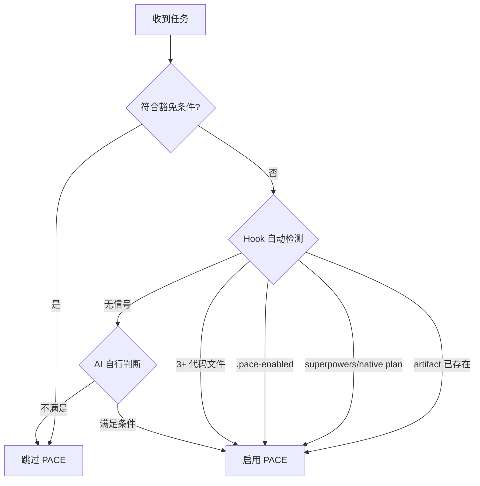

# PACE 协议工作流程

v6 的核心变化：artifact 由 `artifact-writer` agent 创建和维护。主 session 负责分析、执行代码、验证和向用户确认；artifact 写入动作统一派 agent。

---

## 激活判定



启用后遵循 P-A-C-E-V。禁止用主 session 直接 Edit/Write artifact 来绕过 agent。

在已触发 PACEflow 信号的项目中，代码修改任务即使只涉及 1-2 个文件，也先按本 skill 判断流程；不要等第一次 Edit 被 hook 拦截后才进入 PACE。

Artifact 根目录以 hook 注入或 PreToolUse 提示为准。`artifact_dir` 仅用于 PaceFlow artifacts：`spec.md` / `task.md` / `implementation_plan.md` / `walkthrough.md` / `findings.md` / `corrections.md` / `changes/**`。

`spec.md` 是 artifact root 内的项目事实文件，用于记录技术栈、依赖、配置、目录结构和编码约定等长期事实。它由主 session 按需要直接 `Edit` 维护，不派 `artifact-writer`，也不参与 CHG/HOTFIX 的批准、验证或归档流程。

若用户已经明确选择 Obsidian vault、本地项目目录或自定义 artifact 目录，但 artifact-root 配置尚未写入，正确做法是先运行 hook 提示的 `set-artifact-root` helper（`--choice vault`、`--choice local`，或 `--choice <绝对路径或相对项目 state dir 路径>`），再从目标项目 cwd 运行 reserve helper。helper 会写入权威 runtime 配置位置。禁止手写 `.pace/artifact-root`，尤其不要在 git worktree 分支目录里手写该文件。helper 只接受自身文档列出的参数；自动化只可用 `--cwd` 指定项目 cwd，不传自造的 `--artifact-dir` / `--artifact-root` / `--project-dir`。

Helper 命令来源：正确做法是优先使用 SessionStart / PreToolUse 提示中的完整命令。若当前上下文没有完整 helper 命令，以当前 skill 根目录为基准拼成同版本绝对路径：`../../hooks/set-artifact-root.js` 与 `../../hooks/reserve-artifact-id.js`。若无法确定 skill 根目录，先触发/等待 hook 提供 helper 命令。禁止搜索 `~/.claude/plugins/cache` 猜版本。

参考：Superpowers/native plan 桥接细节见 [references/superpowers-integration.md](references/superpowers-integration.md)。

---

## P (Plan)

默认先用 Superpowers / native plan 完成方案探索；无可用规划工具时，主 session 自行完成需求拆解、风险识别和执行方案。

P 阶段产物：
- 用户需求与验收标准清楚。
- 影响范围、技术决策、任务拆分足够拆成一个或多个 CHG。
- 如有 plan 文件，后续由 `pace-bridge` 转成 CHG。

### CHG 粒度原则

CHG 不是大计划容器，而是**连续执行、可验证、可关闭的最小变更单元**。

- 一个 CHG 应该能在当前执行流中连续完成、运行验证、并用 `close-chg` 收尾。
- 一个 CHG 内可以有多个 `T-NNN`，但这些任务必须服务于同一个闭环，不应横跨多个独立功能/模块。
- 大计划应拆成多个可独立完成和验证的 CHG。比如数据结构/迁移、后端接口、前端调用、文档配置通常应是不同 CHG。
- 如果某个任务预计要暂停、等待用户、跨 session 继续、或在不同 worktree 并发推进，优先拆出独立 CHG。
- Artifact 是流程恢复和审计机制，不是逐步项目管理看板；不要为了每个小步骤都派 agent 更新任务状态。

---

## A (Artifact)

### 有 plan 文件

调用 `paceflow:pace-bridge`。bridge 的职责是读取 plan，按上方 CHG 粒度原则拆成一个或多个 `create-chg` 输入，然后派 `artifact-writer` 生成：

- `changes/chg-yyyymmdd-nn.md`
- `task.md` wikilink 索引
- `implementation_plan.md` wikilink 索引

Superpowers/native plan 中用户已参与设计且确认开始时，bridge 只对**当前准备连续执行的 CHG**继续派 `update-chg action=approve-and-start`，并带 `approval-confirmed/source/evidence/task-id`，形成 auto-APPROVED + 首个任务开始。后续 CHG 保持 planned，等真正开始时再批准/开始。

### 无 plan 文件

主 session 先预留编号，再组织字段派 artifact writer。优先使用 SessionStart / PreToolUse 提示中的 reserve helper 完整命令；如果上下文没有完整命令，按上方 helper 命令来源从当前 skill 根目录拼出同版本绝对路径；不要搜索 `~/.claude/plugins/cache` 猜版本。

```bash
<运行 hook 提供的 node ".../hooks/reserve-artifact-id.js" --operation create-chg 命令>
```

HOTFIX 必须在预留时声明类型：

```bash
<运行 hook 提供的 node ".../hooks/reserve-artifact-id.js" --operation create-chg --type hotfix 命令>
```

同一 session 默认复用尚未消费的 `create-chg` reservation。若已经预留过普通 CHG，现在要创建 HOTFIX，或确实需要第二个新编号，重新运行 helper 时加 `--new`：

```bash
<运行 hook 提供的 node ".../hooks/reserve-artifact-id.js" --operation create-chg --type hotfix --new 命令>
```

将 helper 输出的 `artifact_dir` / `operation` / `execution-context` / `reserved-id` / `reserved-file` 原样放在 Agent prompt 顶部，再追加：

```text
title: <变更标题>
tasks:
  - T-001: <任务标题与验收>
  - T-002: <任务标题与验收>
background: <Why>
scope: <What>
technical-decision: <How>
```

A 阶段完成标志：`task.md` 与 `implementation_plan.md` 有同一个活跃 `[[chg-*]]` / `[[hotfix-*]]` 索引，且 `changes/<id>.md` 存在。

若没有先运行 helper，`create-chg` 首次派遣会被 hook 阻止并返回 `reserved-id` / `reserved-file`；把这些字段原样加入 Agent prompt 后重派，不要让 agent 自行扫描索引分配编号。

---

## Legacy v5 与 Worktree

检测到旧 v5 artifact（有 `task.md` / `implementation_plan.md` 活跃内容但无 `changes/`）时，先按 hook 提示执行 dry-run 迁移或桥接为 v6 CHG；迁移确认前不要创建 `changes/`，也不要把迁移本身报告成原代码任务完成。迁移或桥接完成后，再重试被阻止的原始写代码动作。

Git worktree 中的 artifact root 与运行态 `.pace/` 归一到宿主项目。主 session 修改普通项目文件仍以当前 cwd/worktree 为准；只有 PaceFlow artifacts 与 `.pace` 运行态走宿主共享位置。不要在 worktree 分支目录手写 `.pace/artifact-root`。

---

## C (Check)

未批准前禁止修改代码。

需要用户确认时，先停止执行并询问是否批准当前 CHG。用户批准且准备开始时派：

```text
artifact_dir: <SessionStart hook 提供的 artifact 目录>
operation: update-chg
target: CHG-YYYYMMDD-NN
action: approve-and-start
task-id: T-001
approval-confirmed: true
approval-source: user-directive | ask-user-question | accepted-plan | prior-approved-plan
approval-evidence: <用户原话或已确认方案摘要>
```

若只是先批准、暂不执行，则派 `update-chg action=approve`，同样必须带 `approval-confirmed: true`、`approval-source`、`approval-evidence`。C 阶段批准标记只写入 `changes/<id>.md`；`task.md` 只保留索引，不承载批准标记。

如果用户已经直接要求“开始做/按方案执行/继续实现”，或已通过 plan/AskUserQuestion 明确批准，可以把这句话或确认摘要作为 `approval-evidence`；但仍必须先派 `approve-and-start`，再写代码，不能跳过 C 阶段。

需要 AskUserQuestion 确认批准时，必须提供 2-3 个互斥选项，例如“批准并开始”与“暂不执行”；不要只提供单个确认选项。

PreToolUse 放行条件：活跃 CHG 在 `task.md` 与 `implementation_plan.md` 都存在，详情文件存在，已 APPROVED，且状态/checkbox 已进入可执行状态。`APPROVED` 只是 C 阶段完成；`[ ] planned + APPROVED` 仍是 ready/deferred，不能写项目文件，必须先 `approve-and-start` 或恢复为 `[/]`。

`[!]` 是 blocked/deferred：
- PreToolUse 仍会阻止继续写项目文件。
- Stop 允许结束当前 turn，但会显示人可见提醒，恢复前不能继续写。

---

## E (Execute)

按 CHG 的 `## 任务清单` 连续执行代码修改。默认路径是：批准并开始 → 写代码/测试 → 运行并读取验证 → `close-chg complete-open-tasks:true` 一次收口。不要把同一个连续 CHG 的每个 T-NNN 完成都变成一次 `update-status` agent 调用。

| 场景 | agent 操作 |
|------|------------|
| 批准并开始当前 CHG | `update-chg target=CHG-... action=approve-and-start ... task-id=T-NNN` |
| 连续执行完成且验证已通过 | `close-chg target=CHG-... verification-confirmed=true complete-open-tasks=true` |
| 用户要求暂停/先停/等待外部信息 | `update-chg target=CHG-... section=tasks action=update-status task-id=T-NNN new-status=[!] status-reason=<原因>` |
| 跨 session 前记录已完成任务 | `update-chg target=CHG-... section=tasks action=update-status task-id=T-NNN new-status=[x]` |
| 已批准但暂不开始，后来单独开始某任务 | `update-chg target=CHG-... section=tasks action=update-status task-id=T-NNN new-status=[/]` |
| 任务跳过 | `update-chg target=CHG-... section=tasks action=update-status task-id=T-NNN new-status=[-]` |
| 任务阻塞 | `update-chg target=CHG-... section=tasks action=update-status task-id=T-NNN new-status=[!] block-reason=<原因>` |
| 补充实施说明 | `update-chg target=CHG-... section=implementation action=append` |
| 记录执行过程 | `update-chg target=CHG-... section=work-record action=append` |

`update-status [!]` 是暂停/阻塞信号，不是完成，也不是让其他 worktree 自动接手的信号。恢复前先确认用户意图，再把任务重新标为 `[/]` 继续，或按用户决策标 `[-]` / 取消。

`update-status [x]` 是跨 session/非连续任务记录的例外路径，不是连续执行中的默认路径。最后一个任务代码写完后不要先派 `update-status` 再验证；先运行验证并读取结果，验证通过后用 `close-chg complete-open-tasks=true` 一次收口。若暂时不准备验证或必须把进度留给后续 session，才用 `update-status [x]` 把进度停在 completed 待验证状态。

方案根本性错误时：将当前任务标 `[!]`，停止写代码，重新说明偏差并回到 A/C；更新方案和重新批准也必须通过 artifact writer。

---

## V (Verify)

执行验证前不要声称完成。验证遵循 `superpowers:verification-before-completion` 的 IDENTIFY → RUN → READ → VERIFY → CLAIM；无测试框架时用可复现的手动命令或浏览器验证。

验证通过后优先派一次收尾合并操作：

```text
artifact_dir: <SessionStart hook 提供的 artifact 目录>
operation: close-chg
target: CHG-YYYYMMDD-NN
verification-confirmed: true
complete-open-tasks: true
verify-summary: <测试/手动验证摘要>
walkthrough-summary: <完成摘要>
```

artifact writer 会同时写：
- 必要时把当前 CHG 的 `[ ]` / `[/]` 任务收口为 `[x]`，先推 frontmatter `status: completed`，最终归档为 `status: archived`
- frontmatter `verified-date: YYYY-MM-DDTHH:mm:ss+08:00`
- `changes/<id>.md` 中紧邻 `<!-- APPROVED -->` 下一行的 `<!-- VERIFIED -->`
- `## 工作记录` 验证摘要
- `task.md` / `implementation_plan.md` 归档索引与 `walkthrough.md` 完成索引

若只记录验证、暂不归档，才派 `update-chg action=verify`。Stop hook 会在 AI 主动停止时阻止 `completed` 但未 verified 的 CHG 结束会话。

---

## 归档

已 verified 且只需单独归档时派：

```text
artifact_dir: <SessionStart hook 提供的 artifact 目录>
operation: archive-chg
target: CHG-YYYYMMDD-NN
walkthrough-summary: <完成摘要>
```

归档不是移动详情内容，也不是主 session 上移 `<!-- ARCHIVE -->`。v6 归档由 artifact writer 完成：
- 详情 frontmatter `status: archived` + `archived-date`
- `task.md` / `implementation_plan.md` 索引行移动到 ARCHIVE 下方
- active 区不再保留该 CHG

---

## 豁免与适用

| 使用 PACE | 跳过 PACE |
|-----------|-----------|
| 多步骤任务（3+ 步骤） | 简单问答 |
| 研究型任务 | 单文件小修改 |
| 构建/创建项目 | 快速查询 |
| 涉及多次工具调用 | 纯文档/注释 |

豁免不允许覆盖 hook 已经识别为 PACE 项目的强制规则；被 hook deny 时按提示派 artifact writer 修复 artifact 状态。
