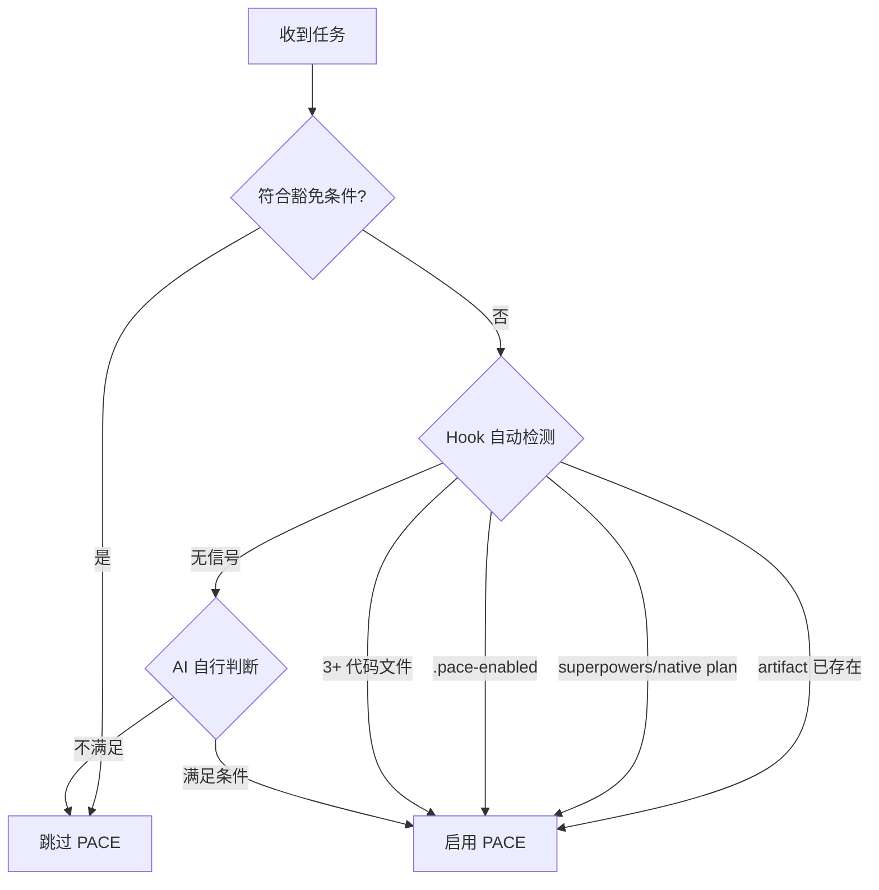

# PACE 协议工作流程

v6 的核心变化：artifact 由 `artifact-writer` agent 创建和维护。主 session 负责分析、执行代码、验证和向用户确认；artifact 写入动作统一派 agent。

---

## 激活判定



启用后遵循 P-A-C-E-V-R。artifact 写入统一派 `artifact-writer` agent，主 session 通过 agent 完成创建/更新。

在已触发 PACEflow 信号的项目中，代码修改任务即使只涉及 1-2 个文件，也先按本 skill 判断流程；收到代码任务立即按流程判断，在第一次 Edit 前进入 PACE。

Artifact 根目录以 hook 注入或 PreToolUse 提示为准。`artifact_dir` 仅用于 PaceFlow artifacts：`spec.md` / `task.md` / `implementation_plan.md` / `walkthrough.md` / `findings.md` / `corrections.md` / `changes/**`。

Project Root 是 PACEflow 管理边界；`local` artifact root 表示 Project Root 本地目录，不是当前子目录。Current CWD 位于父级 Project Root 内时，沿用父项目 artifact、owner、Stop 和 `.pace` 运行态。若当前子目录确实是独立项目，先运行 hook 提示的 `set-project-root` helper（`--mode independent`），再选择 artifact root。

继续、恢复或收口已有 CHG 前，先 `Read` 对应 `changes/<id>.md`，确认 `## 任务清单`、实施详情和 `## 工作记录`；SessionStart 摘要只用于定位，不替代 CHG 详情。

`spec.md` 是 artifact root 内的项目事实文件，用于记录技术栈、依赖、配置、目录结构和编码约定等长期事实。它由主 session 按需要直接 `Edit` 维护，不派 `artifact-writer`，也不参与 CHG/HOTFIX 的批准、验证或归档流程。

若用户已经明确选择 Obsidian vault、本地项目目录或自定义 artifact 目录，但 artifact-root 配置尚未写入，正确做法是先运行 hook 提示的 `set-artifact-root` helper（`--choice vault`、`--choice local`，或 `--choice <绝对路径或相对 Project Root 路径>`），再从目标项目 cwd 运行 reserve helper。helper 会写入权威 runtime 配置位置。`.pace/artifact-root` 只由 `set-artifact-root` helper 写入；git worktree 与继承父 Project Root 的子目录走宿主项目共享位置。helper 接受自身文档列出的参数；自动化用 `--cwd` 指定项目 cwd，其余 artifact/root/project 路径由 helper 自行解析。

Helper 命令来源按以下顺序执行：

1. 如果 SessionStart / PreToolUse 已给出完整 `node ".../hooks/*.js"` 命令，直接复制那条命令。
2. 如果当前项目还没有 PACEflow 信号，但本 skill 已加载，使用 Claude Code 加载本 skill 时提供的 skill 根目录（本 `SKILL.md` 所在目录）作为 `<skill-root>`。按当前动作选择下面一条模板运行；这不是顺序执行清单：

```bash
node "<skill-root>/../../hooks/set-project-root.js" --mode independent
node "<skill-root>/../../hooks/set-artifact-root.js" --choice local
node "<skill-root>/../../hooks/set-artifact-root.js" --choice vault
node "<skill-root>/../../hooks/reserve-artifact-id.js" --operation create-chg
```

3. 如果当前上下文没有完整 hook 命令，也没有可用的 skill 根目录元数据，先触发/等待 hook 给出 helper 命令。helper 路径以 hook 命令或 skill 根目录为准，不扫描 `~/.claude/plugins/cache` 猜版本。

### disable 是用户退出权，非 AI 绕过手段

被 PACE deny 拦住时，正确做法是走 PACE 流程（建 CHG / approve-and-start），**不是 disable 绕过**。`/paceflow:disable`（即 `set-activation --disable`）停用整个项目的 PACEflow，只在用户**明确表达「不想用 PACE 管理本项目」**时执行；AI **不得为绕过单次 deny 自主 disable**。若判断用户可能想停用但用户未明说，先用 AskUserQuestion 确认，不自作主张。用户主动运行 `/paceflow:disable` 时直接执行，不再额外确认。

`/paceflow:pause`（即 `set-activation --pause`）是 session 级对应物：仅本 session 暂停流程门、artifact 完整性门保留、session 结束自动失效。防滥用约束同上且更严——AI 不得为绕过单次 deny 自行 pause，仅用户明确表达「本 session 不想要 PACEflow 约束」时执行；恢复用 `/paceflow:resume`。

参考：Superpowers/native plan 桥接细节见 [references/superpowers-integration.md](references/superpowers-integration.md)。

---

## P (Plan)

默认先用 Superpowers / native plan 完成方案探索；无可用规划工具时，主 session 自行完成需求拆解、风险识别和执行方案。

P 阶段产物：
- 用户需求与验收标准清楚。
- 影响范围、技术决策、任务拆分足够拆成一个或多个 CHG。
- 如有 plan 文件，后续由 `pace-bridge` 转成 CHG。

### CHG 粒度原则

CHG 不是大计划容器，而是**连续执行、可独立验证、可独立回滚、可关闭的最小闭环单元**——单个 CHG 自身就是一个能独立验证和回滚的完整变更，也能独立交给一个 worktree/session 执行。

- 一个 CHG 应该能在当前执行流中连续完成、运行验证、并用 `close-chg` 收尾。
- 一个 CHG 内可以有多个 `T-NNN`，但这些任务必须服务于同一个闭环，限定在单个独立功能/模块内。
- 大计划应拆成多个可独立完成和验证的 CHG。比如数据结构/迁移、后端接口、前端调用、文档配置通常应是不同 CHG。
- 按闭环边界拆分，不按 plan 层级合并：N 个独立可闭环功能就是 N 个 CHG，而不是把整个 plan 塞进一个大 CHG。
- 如果某个任务预计要暂停、等待用户、跨 session 继续、或在不同 worktree 并发推进，优先拆出独立 CHG。
- Artifact 是流程恢复和审计机制，按闭环里程碑派 agent 更新任务状态即可，无需为每个小步骤逐一更新。

---

## A (Artifact)

### 有 plan 文件

调用 `paceflow:pace-bridge`。bridge 的职责是读取 plan，按上方 CHG 粒度原则拆成 N 个可闭环 CHG。拆出多个时优先**一次性批量落地**：`reserve --operation create-chg --count N` 取 N 个连号，再用一次 batch create（共享 `change-set` / `change-set-total` 头部 + N 个 `--- CHG i/N ---` 块）派 `artifact-writer`（详见 pace-bridge skill「批量创建」），避免「执行完一个才建下一个」把后续阶段规划只留在 session 上下文。生成：

- `changes/chg-yyyymmdd-nn.md`
- `task.md` wikilink 索引
- `implementation_plan.md` wikilink 索引

Superpowers/native plan 中用户已参与设计且确认开始时，bridge 只对**当前准备连续执行的 CHG**继续派 `update-chg action=approve-and-start`，并带 `approval-confirmed/source/evidence/task-id`，形成 auto-APPROVED + 首个任务开始。后续 CHG 保持 planned，等真正开始时再批准/开始。

### 无 plan 文件

主 session 先预留编号，再组织字段派 artifact writer。优先使用 SessionStart / PreToolUse 提示中的 reserve helper 完整命令；如果上下文没有完整命令，按上方 helper 命令来源从当前 skill 根目录拼出同版本绝对路径。

```bash
node "<SessionStart/PreToolUse 输出的 reserve-artifact-id.js 绝对路径>" --operation create-chg
# 若没有 hook 输出但本 skill 已加载：
node "<skill-root>/../../hooks/reserve-artifact-id.js" --operation create-chg
```

HOTFIX 必须在预留时声明类型：

```bash
node "<SessionStart/PreToolUse 输出的 reserve-artifact-id.js 绝对路径>" --operation create-chg --type hotfix
# 若没有 hook 输出但本 skill 已加载：
node "<skill-root>/../../hooks/reserve-artifact-id.js" --operation create-chg --type hotfix
```

同一 session 默认复用尚未消费的 `create-chg` reservation。若已经预留过普通 CHG，现在要创建 HOTFIX，或确实需要第二个新编号，重新运行 helper 时加 `--new`：

```bash
node "<SessionStart/PreToolUse 输出的 reserve-artifact-id.js 绝对路径>" --operation create-chg --type hotfix --new
# 若没有 hook 输出但本 skill 已加载：
node "<skill-root>/../../hooks/reserve-artifact-id.js" --operation create-chg --type hotfix --new
```

将 helper 输出的 `artifact_dir` / `operation` / `execution-context` / `reserved-id` / `reserved-file-prefix` 原样放在 Agent prompt 顶部，再追加：

```text
title: <变更标题>
tasks:
  - T-001: <任务标题与验收>
  - T-002: <任务标题与验收>
background: <Why>
scope: <What>
technical-decision: <How>
```

A 阶段完成标志：`task.md` 与 `implementation_plan.md` 有同一个活跃 `[[chg-*]]` / `[[hotfix-*]]` 索引，且 `changes/<id>.md` 存在。

若没有先运行 helper，`create-chg` 首次派遣会被 hook 阻止并返回 `reserved-id` / `reserved-file-prefix`；把这些字段原样加入 Agent prompt 后重派，编号一律来自 helper 预留。

---

## Legacy v5 与 Worktree

检测到旧 v5 artifact（有 `task.md` / `implementation_plan.md` 活跃内容但无 `changes/`）时，先按 hook 提示执行 dry-run 迁移或桥接为 v6 CHG；`changes/` 在迁移确认后才创建，迁移本身作为迁移动作单独说明、与原代码任务完成分开汇报。迁移或桥接完成后，再重试被阻止的原始写代码动作。

Git worktree 中的 artifact root 与运行态 `.pace/` 归一到宿主项目。普通子目录默认继承最近父级 Project Root。主 session 修改普通项目文件仍以当前 cwd/worktree 为准；只有 PaceFlow artifacts 与 `.pace` 运行态走 Project Root 共享位置。`.pace/artifact-root` 只由 `set-artifact-root` helper 写入；git worktree 与继承父 Project Root 的子目录走宿主项目共享位置。独立子项目先用 `set-project-root --mode independent` 声明边界。

---

## C (Check)

改代码前先获批准：`<!-- APPROVED -->` 已写入 `changes/<id>.md` 且对应任务为 `[/]`。

需要用户确认时，先停止执行并询问是否批准当前 CHG。用户批准且准备开始时派：

```text
artifact_dir: <SessionStart hook 提供的 artifact 目录>
operation: update-chg
target: CHG-YYYYMMDD-NN
action: approve-and-start
task-id: T-001
approval-confirmed: true
approval-source: user-directive | ask-user-question | accepted-plan | prior-approved-plan
approval-evidence: <用户原话或已确认方案摘要>
```

若只是先批准、暂不执行，则派 `update-chg action=approve`，同样必须带 `approval-confirmed: true`、`approval-source`、`approval-evidence`。C 阶段批准标记只写入 `changes/<id>.md`；`task.md` 只保留索引，不承载批准标记。

如果用户已经直接要求“开始做/按方案执行/继续实现”，或已通过 plan/AskUserQuestion 明确批准，可以把这句话或确认摘要作为 `approval-evidence`；仍先派 `approve-and-start` 再写代码，让 C 阶段先行完成。

需要 AskUserQuestion 确认批准时，提供 2-3 个互斥选项，例如“批准并开始”与“暂不执行”。

PreToolUse 放行条件：活跃 CHG 在 `task.md` 与 `implementation_plan.md` 都存在，详情文件存在，已 APPROVED，且状态/checkbox 已进入可执行状态。`APPROVED` 标志 C 阶段完成；`[ ] planned + APPROVED` 属 ready/deferred，写项目文件前先 `approve-and-start` 或恢复为 `[/]` 进入 `in-progress`。

`[!]` 是 blocked/deferred：
- PreToolUse 仍会阻止继续写项目文件。
- Stop 允许结束当前 turn，但会显示人可见提醒，恢复前不能继续写。

---

## E (Execute)

按 CHG 的 `## 任务清单` 连续执行代码修改。默认路径是：批准并开始 → 写代码/测试 → 运行并读取验证 → `close-chg complete-open-tasks:true` 一次收口。同一个连续 CHG 的多个 T-NNN 由这一次 `close-chg` 统一收口；`update-status` 仅在暂停/阻塞/跳过/跨 session 时单独调用。

| 场景 | agent 操作 |
|------|------------|
| 批准并开始当前 CHG | `update-chg target=CHG-... action=approve-and-start ... task-id=T-NNN` |
| 连续执行完成且验证已通过 | `close-chg target=CHG-... verification-confirmed=true complete-open-tasks=true implementation-notes=<per-task 实施说明>` |
| 用户要求暂停/先停/等待外部信息 | `update-chg target=CHG-... section=tasks action=update-status task-id=T-NNN new-status=[!] status-reason=<原因>` |
| 跨 session 前记录已完成任务 | `update-chg target=CHG-... section=tasks action=update-status task-id=T-NNN new-status=[x]` |
| 已批准但暂不开始，后来单独开始某任务 | `update-chg target=CHG-... section=tasks action=update-status task-id=T-NNN new-status=[/]` |
| 任务跳过 | `update-chg target=CHG-... section=tasks action=update-status task-id=T-NNN new-status=[-]` |
| 任务阻塞 | `update-chg target=CHG-... section=tasks action=update-status task-id=T-NNN new-status=[!] block-reason=<原因>` |
| 补充实施说明 | `update-chg target=CHG-... section=implementation action=append` |
| 记录执行过程 | `update-chg target=CHG-... section=work-record action=append` |

`update-status [!]` 仅表示暂停/阻塞，保持任务待恢复，其他 worktree 仍需显式接手。恢复前先确认用户意图，再把任务重新标为 `[/]` 继续，或按用户决策标 `[-]` / 取消。

`update-status [x]` 是跨 session/非连续任务记录的例外路径；连续执行的默认路径是 `close-chg`。最后一个任务代码写完后，先运行验证并读取结果，验证通过后用 `close-chg complete-open-tasks=true` 一次收口（由它收尾最后任务，无需先派 `update-status`）。若暂时不准备验证或必须把进度留给后续 session，才用 `update-status [x]` 把进度停在 completed 待验证状态。

方案根本性错误时：将当前任务标 `[!]`，停止写代码，重新说明偏差并回到 A/C；更新方案和重新批准也必须通过 artifact writer。

---

## V (Verify)

先运行验证、读取结果，再声称完成。验证遵循 `superpowers:verification-before-completion` 的 IDENTIFY → RUN → READ → VERIFY → CLAIM；无测试框架时用可复现的手动命令或浏览器验证。

验证通过**不直接收口**——先完成下面的 **R（审计）** 步骤，再派 close-chg 一并写 VERIFIED + REVIEWED + 归档。R 跑完后的收尾合并操作：

```text
artifact_dir: <SessionStart hook 提供的 artifact 目录>
operation: close-chg
target: CHG-YYYYMMDD-NN
verification-confirmed: true
complete-open-tasks: true
review-confirmed: true
review-source: manual | <所选 review agent 名>
review-findings: <P0/P1/P2/P3 计数 + 各自处置（HOTFIX / won't-fix finding / record-finding 的 wikilink）>
verify-summary: <测试/手动验证摘要>
implementation-notes:
  - T-NNN: <该任务实际改动——改了哪些文件、关键实现、对应 commit>
walkthrough-summary: <完成摘要>
```

`implementation-notes` 必填（与 `verify-summary` 同款内容字段，hook 缺失即拒绝）：close 前主 session 按任务整理实际改动说明，agent 据此写入 `## 实施详情` 段 `### T-NNN` 标题下——缺失则详情文件只剩创建时的规划态信息（Why/What/How），执行情况无从审计。`update-chg action=verify`（只记录验证暂不归档）不要求此字段。

artifact writer 会同时写：
- 必要时把当前 CHG 的 `[ ]` / `[/]` 任务收口为 `[x]`，先推 frontmatter `status: completed`，最终归档为 `status: archived`
- `## 实施详情` 段各任务 `### T-NNN` 执行态记录（来自 `implementation-notes`）
- frontmatter `verified-date: YYYY-MM-DDTHH:mm:ss+08:00`
- `changes/<id>.md` 中紧邻 `<!-- APPROVED -->` 下一行的 `<!-- VERIFIED -->`
- frontmatter `reviewed-date` 与紧邻 `<!-- VERIFIED -->` 下一行的 `<!-- REVIEWED -->`（R 阶段标记，详见下方 R 小节与 Skill(paceflow:artifact-management)）
- `## 工作记录` 验证摘要、`## 审查记录` findings 处置
- `task.md` / `implementation_plan.md` 归档索引与 `walkthrough.md` 完成索引

若只记录验证、暂不归档，才派 `update-chg action=verify`。Stop hook 会在 AI 主动停止时阻止 `completed` 但未 verified 的 CHG 结束会话；已 verified 但未 reviewed 时同样拦截，要求先跑 R 审计（见下）。

---

## R (Review)

> R 是与 V 同构的一等流程步骤：CHG 收口前，主 session 对本 CHG diff 做一次**对抗审计**，把"审计这步跑过了"连同验证、归档一起记录。**只强制审计步骤发生 + 记录，从不裁决代码质量。** 审计挖出的 findings 走既有 HOTFIX / record-finding 处置，不卡 close（阻断-on-步骤，不阻断-on-结论）。

**职责分层**：R 是**主 session 的编排活**（派 review subagent、读报告、判断 findings 处置），**不是 artifact-writer 的动作**——artifact-writer 只在收尾时落 `reviewed-date` + `<!-- REVIEWED -->` + `## 审查记录` 三项证据。完整通用方法论见 [references/review-methodology.md](references/review-methodology.md)。

验证通过后、派 close-chg 之前，按以下五步编排 R：

1. **看本 CHG diff**：先过一遍本次 CHG 的实际改动（改了哪些文件、哪类逻辑），作为选审查棱镜的依据。
2. **按内容自选 review agent，用方法论 direct**：根据改动内容选合适的审查视角（逻辑/边界改动→路径追踪棱镜；多文件对齐→一致性/实际 diff 棱镜；契约/配置/安全→协议合规棱镜；琐碎小改→主 session 自己瞄一眼 `review-source: manual`），**不固化一套标准 agent**。用 `references/review-methodology.md` 的七条内核 direct 所派 subagent，要求其输出 **P0-P3 分级报告**。
   > **执行约束（硬性）**：审计 subagent 必须 **inline / foreground 派发**（Task / Agent 工具同步等待），**不可作为 background / detached 任务**。inline 时主 session 阻塞在 tool call 上（mid-turn），审计必然在本轮收尾前返回；若错误派成 background，主 session 可能在审计在途时就 end-turn，撞上 Stop 的"未审计"拦截。
3. **读 P0-P3 报告**：P0=有具体触发路径的功能错误/数据丢失/流程阻塞；P1=高影响但不直接阻塞；P2=代码质量/文档过时；P3=优化建议。
4. **路由 findings**（主 session 判断，调既有 writer 操作）：
   - **修前复核（路由到「修」的前置）**：review 报告是**待评估建议、非命令**。路由任何 finding 去「修」前，主 session 用三件武器（最小复现 / 路径追踪 / 设计意图查证）**独立复核为真**，复核不下来就不修（降级 / `record-finding` / won't-fix）。subagent 的 Phase 2 不替代这一步。细节见 [references/review-methodology.md](references/review-methodology.md) step 4。
   - **P0 / P1** → 复核为真后开 HOTFIX（`create-chg --type hotfix`）修，或判定不修则记 won't-fix finding（`record-finding` 带 `status: rejected` + `rejection-reason`，落 `[-]`，不注入 SessionStart）；
   - **P2 / P3** → 派 `record-finding` 进 backlog：actionable 待修留 `[ ]`（默认），已决定不修标 `[-]`（won't-fix，同样 `status: rejected` + `rejection-reason`）；
   - **迭代闸**：审计-findings 生出的 HOTFIX **默认不自动重审**（深度=1），防"审计→修→再审"无止境递归。
5. **派 close-chg**：findings 路由完成后，派上方 V 段的 `close-chg`（含 `review-confirmed: true` / `review-source` / `review-findings`）一把梭折叠 VERIFIED + REVIEWED + 归档；只想记录审计暂不归档时，才派 `update-chg action=review`。

> **阻断语义**：close 前必须"审计这步跑过并记录 findings 处置"（阻断-on-步骤），但绝不要求"P0/P1 修完"才放行 close（不阻断-on-结论）。审计挖出 5 个 P0 全部路由成 won't-fix，照样满足 REVIEWED。

---

## 归档

已 verified 且只需单独归档时派：

```text
artifact_dir: <SessionStart hook 提供的 artifact 目录>
operation: archive-chg
target: CHG-YYYYMMDD-NN
walkthrough-summary: <完成摘要>
```

归档不是移动详情内容，也不是主 session 上移 `<!-- ARCHIVE -->`。v6 归档由 artifact writer 完成：
- 详情 frontmatter `status: archived` + `archived-date`
- `task.md` / `implementation_plan.md` 索引行移动到 ARCHIVE 下方
- active 区不再保留该 CHG

---

## 豁免与适用

| 使用 PACE | 跳过 PACE |
|-----------|-----------|
| 多步骤任务（3+ 步骤） | 简单问答 |
| 研究型任务 | 单文件小修改 |
| 构建/创建项目 | 快速查询 |
| 涉及多次工具调用 | 纯文档/注释 |

豁免不允许覆盖 hook 已经识别为 PACE 项目的强制规则；被 hook deny 时按提示派 artifact writer 修复 artifact 状态。
