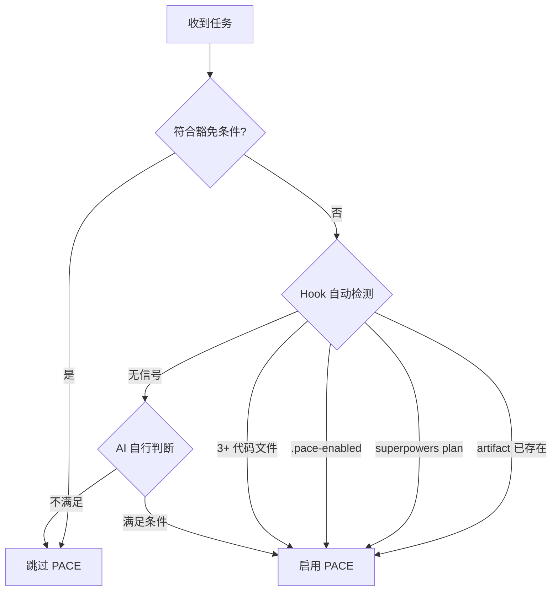

# PACE 协议工作流程

当任务满足触发条件时，执行此工作流程。

## 激活判定流程



> 豁免条件详见 **User Rule G-8**
>
> **v4.3.1 Hook 行为**：
> - `isPaceProject()` 四信号优先级：`artifact` > `superpowers` > `manual` > `code-count`
> - `hasActiveTasks`：仅 `[ ]`/`[/]`/`[!]` 算活跃任务，`[x]`/`[-]` 不算
> - `isInsideProject`：项目外文件（如 `~/.claude/hooks/`）豁免 PACE 检查
> - SessionStart `[-]` 提醒：跨会话跳过的任务自动注入上下文提醒

---

## PACE 流程步骤

### P (Plan - 推理)

分析代码上下文、识别依赖、风险评估。

**Superpowers 衔接**：如果 `docs/plans/` 下已有 Superpowers 设计/计划文件，P 阶段读取其内容作为输入，补充风险评估而非重做规划。

**Superpowers → PACE 同步**（强制）：
当执行 Superpowers 的 writing-plans 或 executing-plans 流程时：
1. **writing-plans 完成后**：读取 plan 文件中的 Task 列表，转写为 `task.md` 的 `- [ ] T-NNN` 格式
2. **获得用户批准后**：在 `task.md` 添加 `<!-- APPROVED -->` + 将首个任务标为 `[/]`
3. **每个 Task 完成后**：同步更新 `task.md` 状态（`[/]` → `[x]`）

**搜索资源优先级**：
1. **Context7 MCP**：库/框架官方文档（优先）
2. **互联网搜索**：通用问题、Stack Overflow、博客
3. **GitHub Issues/Discussions**：特定库的已知问题

### A (Artifact - 计划)

1. 创建/更新 `task.md`
2. 累积更新 `implementation_plan.md`
3. 读取 `skills/change-management/SKILL.md` 执行变更 ID 管理

**Superpowers 衔接**：`implementation_plan.md` 活跃变更详情中引用 Superpowers plan 文件路径：
```markdown
**实施方案**: docs/plans/YYYY-MM-DD-feature.md
```

### C (Check - 确认)

**停止执行**，询问用户：是否批准该计划？

**前置检查**（询问确认前必须执行）：
- 重读 `task.md` - 确认任务范围未偏离
- 重读 `implementation_plan.md` - 确认技术方案一致

**获批后**：在 `task.md` 活跃区添加 `<!-- APPROVED -->` 标记，或将首个任务标为 `[/]` 进行中。

> [!note] v4.3.2 Hook 强制
> PreToolUse 会检查活跃区是否有 `<!-- APPROVED -->` 标记或 `[/]` 任务。
> 若所有任务为 `[ ]` 且无 APPROVED 标记，写代码文件会被 **deny**。

**严禁批准前修改代码。**

### E (Execute - 执行)

获批后执行：
1. 更新 `task.md` 进度
2. 累积更新 `walkthrough.md`
3. 技术栈变更时同步更新 `spec.md`

**执行中检查**：
- 每完成 5 个子任务后，重读 `task.md` 确认方向正确
- 对话超过 20 轮时，主动重读核心 Artifact 刷新上下文

### V (Verify - 验证)

**测试要求**：
- **必须测试**：API 端点、数据处理函数、安全相关逻辑
- **建议测试**：业务逻辑函数、工具函数
- **可选测试**：UI 组件、一次性脚本

**验证替代**：
- 若项目无测试框架，可通过 Terminal/Browser 手动验证
- 验证结果必须记录到 walkthrough.md

**验证通过后**：在 `task.md` 活跃区添加 `<!-- VERIFIED -->` 标记。

> [!note] v4.3.2 Hook 强制
> Stop hook 会检查活跃区是否有 `[x]` 完成项但无 `<!-- VERIFIED -->` 标记。
> 若未验证，退出会被 **block**："请执行 V 阶段验证后添加标记"。

**验证完成后**：执行 **User Rule G-9** 完成检查清单。

---

## 持续维护职责

- 子任务完成后，立即更新 `task.md` 进度
- 用户修正偏好时，同步更新所有相关 Artifact

---

## 豁免条件 & 核心模块

详细定义请查阅 **User Rule G-8**。

- **核心模块**：入口文件、安全模块、数据层等。
- **豁免条件**：<100 行非核心修改、纯文档修改等。

---

## 适用场景速查

| 使用 PACE | 跳过 PACE |
|-----------|-----------|
| 多步骤任务（3+ 步骤） | 简单问答 |
| 研究型任务 | 单文件编辑 |
| 构建/创建项目 | 快速查询 |
| 涉及多次工具调用的任务 | |
