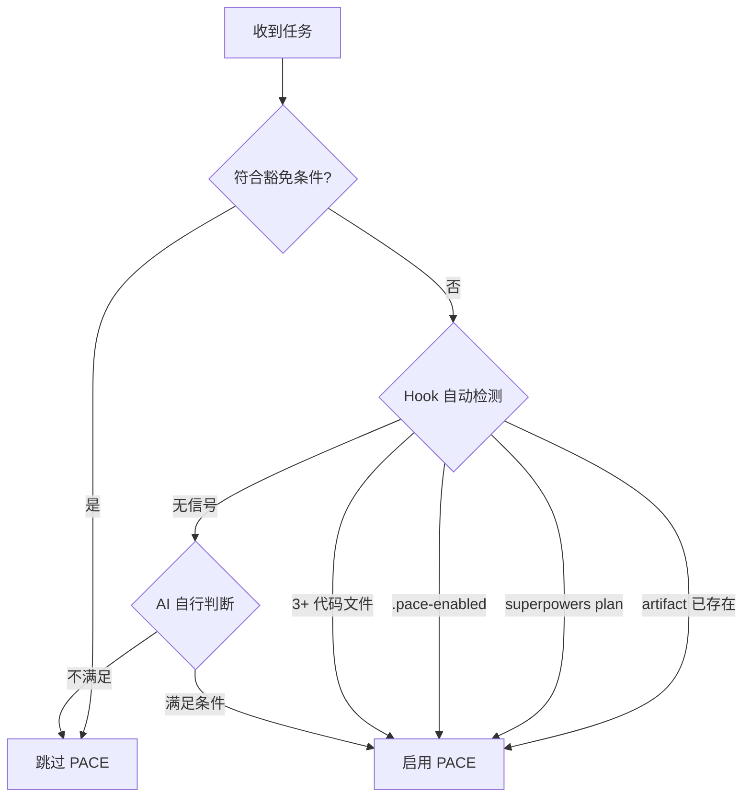

# PACE 协议工作流程

当任务满足触发条件时，执行此工作流程。

## 激活判定流程

> 豁免条件详见 **User Rule G-8**
>
> **v4.8.0 Hook 行为**：
> - `isPaceProject()` 四信号优先级：`artifact` > `superpowers` > `manual` > `code-count`
> - `hasActiveTasks`：仅 `[ ]`/`[/]`/`[!]` 算活跃任务，`[x]`/`[-]` 不算
> - `isInsideProject`：项目外文件（如 `~/.claude/hooks/`）豁免 PACE 检查
> - SessionStart `[-]` 提醒：跨会话跳过的任务自动注入上下文提醒

---

## PACE 流程步骤

### P (Plan - 设计)

**默认使用 brainstorming skill** 探索设计空间：

invoke `superpowers:brainstorming` — 完整 6 步流程：
1. 探索项目上下文
2. 提问澄清需求
3. 提出 2-3 方案 + trade-offs
4. 逐段展示设计
5. 写设计文档 → `docs/plans/YYYY-MM-DD-<topic>-design.md` + git commit
6. 自动 invoke `superpowers:writing-plans` → `docs/plans/YYYY-MM-DD-<feature>.md`

P 阶段完成标志：`docs/plans/` 中有新的计划文件。

**降级条件**（不使用 brainstorming，回退 PACE 原生规划）：
- HOTFIX / 紧急修复
- 用户已给出完整需求，无需设计探索
- 用户明确说"直接做"/"不需要 brainstorming"

降级时：直接分析代码上下文、识别依赖、风险评估，然后进入 A 阶段手动创建 artifacts。

**搜索资源优先级**：
1. **Context7 MCP**：库/框架官方文档（优先）
2. **互联网搜索**：通用问题、Stack Overflow、博客
3. **GitHub Issues/Discussions**：特定库的已知问题

### A (Artifact - 准备)

**Superpowers 流程**（P 阶段使用了 brainstorming）：

invoke `pace-bridge` skill — 自动完成以下步骤：
1. 读取 `docs/plans/` 最新计划文件，提取任务列表
2. 生成 CHG-ID（`CHG-YYYYMMDD-NN`）+ T-NNN 编号
3. 写入 `implementation_plan.md` 变更索引（`[/]` 状态）
4. 写入 `task.md` 活跃任务 + `<!-- APPROVED -->`（auto-APPROVED，详见 [pace-bridge](pace-bridge.md) skill）
5. 输出转换摘要供事后审阅

A 阶段完成标志：task.md 有活跃任务 + `<!-- APPROVED -->` + impl_plan 有 `[/]` 条目。

**降级流程**（P 阶段未使用 brainstorming）：
1. 手动创建/更新 `task.md`
2. 累积更新 `implementation_plan.md`（变更索引添加 `[ ]` 条目）
3. 读取 [change-management](change-management.md) skill 执行变更 ID 管理
4. 进入 C 阶段等待用户审批

**findings 反向关联**：如果本次变更源自 findings.md 调研结论，在对应 finding 条目补 `[change:: CHG-ID]` 并将状态更新为 `[x]`。

> **Artifact 存储位置**：所有 Artifact 文件存储在 Obsidian Vault（`VAULT_PATH/projects/<projectName>/`），PreToolUse hook 自动将 CWD 路径重定向到 vault 路径。详细的 artifact 结构和 Write vs Edit 规则参见 [artifact-management](artifact-management.md)。

### C (Check - 确认)

**Superpowers 流程**：pace-bridge 已在 A 阶段自动标记 `<!-- APPROVED -->`（auto-APPROVED），因为用户在 brainstorming 中已参与设计决策，writing-plans 中已审阅实施计划。C 阶段被吸收，直接进入 E 阶段。

**降级流程**（未使用 Superpowers 时）：
**停止执行**，询问用户：是否批准该计划？

前置检查（询问确认前必须执行）：
- 重读 `task.md` - 确认任务范围未偏离
- 重读 `implementation_plan.md` - 确认技术方案一致

获批后：在 `task.md` 活跃区添加 `<!-- APPROVED -->` 标记，将首个任务标为 `[/]`。同时将 `implementation_plan.md` 变更索引状态从 `[ ]` 改为 `[/]`。

**严禁批准前修改代码。**

> [!note] v4.8.0 Hook 强制
> PreToolUse 会检查活跃区是否有 `<!-- APPROVED -->` 标记或 `[/]` 任务。
> 若所有任务为 `[ ]` 且无 APPROVED 标记，写代码文件会被 **deny**。
> v4.4.3 起还会检查 `implementation_plan.md` 是否有 `[/]` 进行中的变更索引，无则 **deny**。

### E (Execute - 执行)

**Superpowers 流程**：

**Step 1 — Worktree 隔离**（推荐）：
`EnterWorktree` 创建隔离分支。PACEflow 在 worktree 中完全可用（`resolveProjectCwd` 使用 `CLAUDE_PROJECT_DIR` 环境变量定位项目根，vault artifacts 正常访问）。

降级条件（不使用 worktree）：HOTFIX / 单文件修改 / 用户指定不用。

**Step 2 — 选择执行方式**：

| 条件 | 执行 skill | 说明 |
|------|-----------|------|
| task 有依赖 / 高风险 / 核心模块 | `superpowers:executing-plans` | 每 3 task 停下等人工反馈 |
| 独立 task + 不同 domain | `superpowers:dispatching-parallel-agents` | 多 agent 真并行 |
| 独立 task + 同 domain（**默认**） | `superpowers:subagent-driven-development` | 自动 Spec + Code Quality 双审 |
| 降级（HOTFIX / 简单任务） | 直接执行 | 不使用 Superpowers |

**Step 3 — TDD 开发方法**（推荐）：
invoke `superpowers:test-driven-development` — 写失败测试 → 确认失败 → 写最小实现 → 确认通过 → commit。
降级条件：HOTFIX / UI 样式改动 / 无测试框架。

**Step 4 — 收尾**：
invoke `superpowers:finishing-a-development-branch` — 验证测试 → 选择 merge/PR/keep/discard。

**执行中维护**：
1. 更新 `task.md` 进度（`[/]` → `[x]`）
2. 累积更新 `walkthrough.md`
3. 技术栈变更时同步更新 `spec.md`

**并行执行**：标记 `[P]` 的任务可分配给 subagent 或 Agent Teams teammate 并行执行，参见 [artifact-management](artifact-management.md#并行任务标记-p) 中的标记规范。

**执行中检查**：
- 每完成 5 个子任务后，重读 `task.md` 确认方向正确
- 对话超过 20 轮时，主动重读核心 Artifact 刷新上下文

### V (Verify - 验证)

**推荐**：invoke `superpowers:verification-before-completion` — 确保所有完成声称都有新鲜验证证据（IDENTIFY → RUN → READ → VERIFY → CLAIM）。

**测试要求**：
- **必须测试**：API 端点、数据处理函数、安全相关逻辑
- **建议测试**：业务逻辑函数、工具函数
- **可选测试**：UI 组件、一次性脚本

**验证替代**：
- 若项目无测试框架，可通过 Terminal/Browser 手动验证
- 验证结果必须记录到 walkthrough.md

**验证通过后**：在 `task.md` 活跃区添加 `<!-- VERIFIED -->` 标记。

> [!note] v4.8.0 Hook 强制
> Stop hook 会检查活跃区是否有 `[x]` 完成项但无 `<!-- VERIFIED -->` 标记。
> 若未验证，退出会被 **block**："请执行 V 阶段验证后添加标记"。

**验证完成后**：执行 **User Rule G-9** 完成检查清单。

---

## 持续维护职责

- 子任务完成后，立即更新 `task.md` 进度
- 用户修正偏好时，同步更新所有相关 Artifact

---

## 豁免条件 & 核心模块

详细定义请查阅 **User Rule G-8**。

- **核心模块**：入口文件、安全模块、数据层等。
- **豁免条件**：<100 行非核心修改、纯文档修改等。

---

## 适用场景速查

| 使用 PACE | 跳过 PACE |
|-----------|-----------|
| 多步骤任务（3+ 步骤） | 简单问答 |
| 研究型任务 | 单文件编辑 |
| 构建/创建项目 | 快速查询 |
| 涉及多次工具调用的任务 | |
