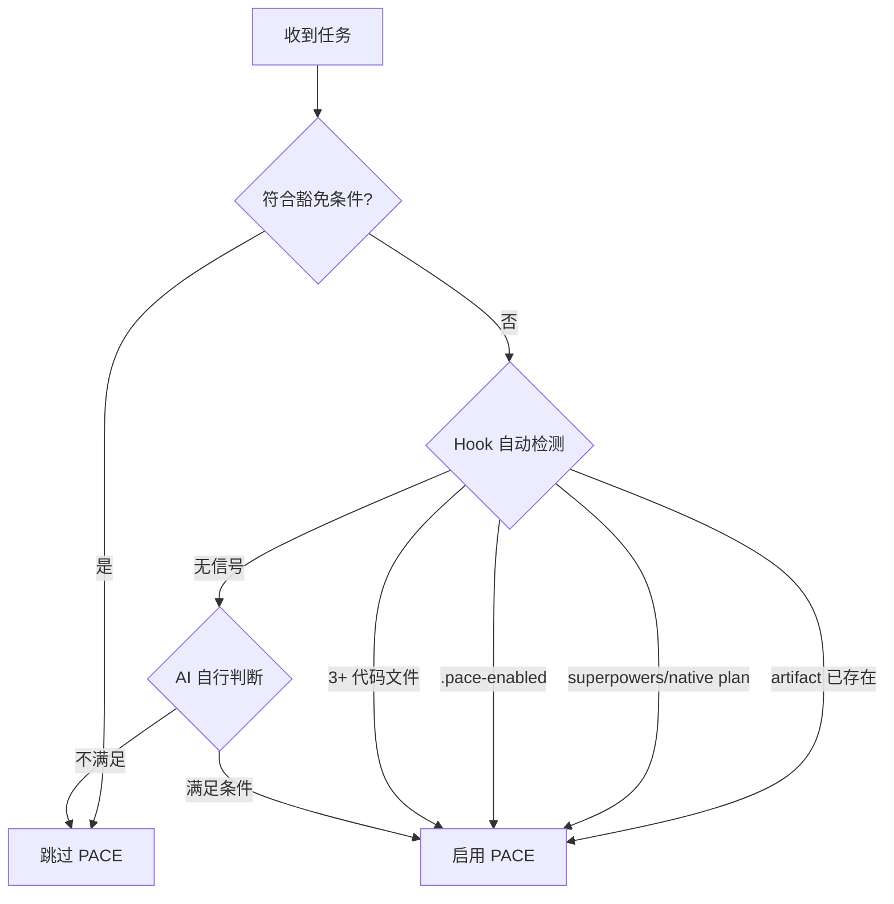

# PACE 协议工作流程

v6 的核心变化：artifact 由 `artifact-writer` agent 创建和维护。主 session 负责分析、执行代码、验证和向用户确认；artifact 写入动作统一派 agent。

---

## 激活判定



启用后遵循 P-A-C-E-V。禁止用主 session 直接 Edit/Write artifact 来绕过 agent。

---

## P (Plan)

默认先用 Superpowers / native plan 完成方案探索；无可用规划工具时，主 session 自行完成需求拆解、风险识别和执行方案。

P 阶段产物：
- 用户需求与验收标准清楚。
- 影响范围、技术决策、任务拆分足够写入 CHG。
- 如有 plan 文件，后续由 `pace-bridge` 转成 CHG。

---

## A (Artifact)

### 有 plan 文件

调用 `paceflow:pace-bridge`。bridge 的唯一职责是读取 plan 并派 `artifact-writer create-chg`，生成：

- `changes/chg-yyyymmdd-nn.md`
- `task.md` wikilink 索引
- `implementation_plan.md` wikilink 索引

Superpowers/native plan 中用户已参与设计且确认开始时，bridge 可在创建后继续派 `update-chg action=approve-and-start`，形成 auto-APPROVED + 首个任务开始。

### 无 plan 文件

主 session 组织以下字段后派 artifact writer：

```text
operation: create-chg
title: <变更标题>
tasks:
  - T-001: <任务标题与验收>
  - T-002: <任务标题与验收>
background: <Why>
scope: <What>
technical-decision: <How>
```

A 阶段完成标志：`task.md` 与 `implementation_plan.md` 有同一个活跃 `[[chg-*]]` / `[[hotfix-*]]` 索引，且 `changes/<id>.md` 存在。

---

## C (Check)

未批准前禁止修改代码。

需要用户确认时，先停止执行并询问是否批准当前 CHG。用户批准且准备开始时派：

```text
operation: update-chg
target: CHG-YYYYMMDD-NN
action: approve-and-start
task-id: T-001
approval-confirmed: true
```

若只是先批准、暂不执行，则派 `update-chg action=approve`。C 阶段批准标记只写入 `changes/<id>.md`；`task.md` 只保留索引，不承载批准标记。

PreToolUse 放行条件：活跃 CHG 在 `task.md` 与 `implementation_plan.md` 都存在，详情文件存在，已 APPROVED，且状态/checkbox 已进入可执行状态。

---

## E (Execute)

按 CHG 的 `## 任务清单` 执行代码修改。执行期间所有 artifact 进度维护仍派 artifact writer：

| 场景 | agent 操作 |
|------|------------|
| 任务开始 | `update-chg section=tasks action=update-status task-id=T-NNN new-status=[/]` |
| 任务完成 | `update-chg section=tasks action=update-status task-id=T-NNN new-status=[x]` |
| 任务跳过 | `update-chg section=tasks action=update-status task-id=T-NNN new-status=[-]` |
| 任务阻塞 | `update-chg section=tasks action=update-status task-id=T-NNN new-status=[!]` |
| 补充实施说明 | `update-chg section=implementation action=append` |
| 记录执行过程 | `update-chg section=work-record action=append` |

当所有任务为 `[x]` 或 `[-]` 时，agent 会把 frontmatter `status` 推到 `completed`，并同步根索引为 `[x]`。

方案根本性错误时：将当前任务标 `[!]`，停止写代码，重新说明偏差并回到 A/C；更新方案和重新批准也必须通过 artifact writer。

---

## V (Verify)

执行验证前不要声称完成。验证遵循 `superpowers:verification-before-completion` 的 IDENTIFY → RUN → READ → VERIFY → CLAIM；无测试框架时用可复现的手动命令或浏览器验证。

验证通过后优先派：

```text
operation: close-chg
target: CHG-YYYYMMDD-NN
verification-confirmed: true
verify-summary: <测试/手动验证摘要>
walkthrough-summary: <完成摘要>
```

artifact writer 会同时写：
- frontmatter `verified-date: YYYY-MM-DDTHH:mm:ss+08:00`
- `changes/<id>.md` 中紧邻 `<!-- APPROVED -->` 下一行的 `<!-- VERIFIED -->`
- `## 工作记录` 验证摘要
- `task.md` / `implementation_plan.md` 归档索引与 `walkthrough.md` 完成索引

若只记录验证、暂不归档，才派 `update-chg action=verify`。Stop hook 会阻止 `completed` 但未 verified 的 CHG 结束会话。

---

## 归档

已 verified 且只需单独归档时派：

```text
operation: archive-chg
target: CHG-YYYYMMDD-NN
walkthrough-summary: <完成摘要>
```

归档不是移动详情内容，也不是主 session 上移 `<!-- ARCHIVE -->`。v6 归档由 artifact writer 完成：
- 详情 frontmatter `status: archived` + `archived-date`
- `task.md` / `implementation_plan.md` 索引行移动到 ARCHIVE 下方
- active 区不再保留该 CHG

---

## 豁免与适用

| 使用 PACE | 跳过 PACE |
|-----------|-----------|
| 多步骤任务（3+ 步骤） | 简单问答 |
| 研究型任务 | 单文件小修改 |
| 构建/创建项目 | 快速查询 |
| 涉及多次工具调用 | 纯文档/注释 |

豁免不允许覆盖 hook 已经识别为 PACE 项目的强制规则；被 hook deny 时按提示派 artifact writer 修复 artifact 状态。
