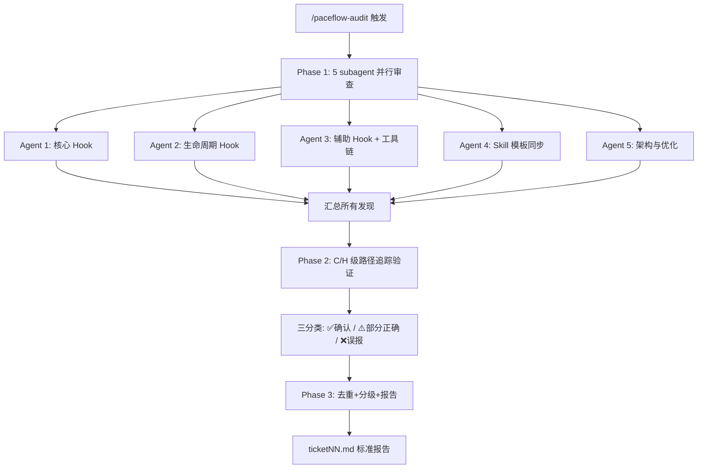

# PACEflow 全面审查

## 触发场景

- 用户说"完整分析"、"全面审查"、"全面检查"
- 用户调用 `/paceflow-audit`
- 需要对 PACEflow 系统进行版本发布前的质量门控

## 审查范围

| 类别 | 文件 | 数量 |
|------|------|------|
| Hook 脚本 | `paceflow/hooks/*.js`（含 pace-utils.js） | 8+1 |
| Skill 定义 | `paceflow/skills/*.md` | 6 |
| Hook 模板 | `paceflow/hooks/templates/*.md` | 5 |
| Skill 模板 | `paceflow/skills/templates/*.md` | 7 |
| 配置 | `paceflow/config/settings-hooks-excerpt.json` | 1 |
| 工具链 | `paceflow/install.js` + `paceflow/verify.js` | 2 |
| 文档 | `CLAUDE.md` + `paceflow/README.md` + `paceflow/REFERENCE.md` | 3 |

---

## 严重度标准（所有 agent 统一）

| 级别 | 标签 | 定义 | 示例 |
|------|------|------|------|
| **C** | Critical | 功能错误、数据丢失、流程阻塞 | 正则遗漏导致 deny 误触发 |
| **H** | High | 影响可靠性但不阻塞 | 异常路径未降级为 exit 0 |
| **W** | Warning | 代码质量、文档过时 | 死代码、注释与实现不一致 |
| **I** | Info | 优化建议、风格改进 | 可提取为共享函数 |

**每个发现必须包含**：文件名:行号、问题描述、建议修复。

---

## Phase 1：五维度并行审查

启动 5 个 subagent **并行**执行审查（使用 Agent 工具，subagent_type: `general-purpose`）。每个 agent 独立读取源码并产出分级发现列表。

### Agent 1：代码质量审查员（核心 Hook）

**审查文件**：
- `paceflow/hooks/pace-utils.js` — 公共工具库
- `paceflow/hooks/pre-tool-use.js` — PreToolUse hook
- `paceflow/hooks/post-tool-use.js` — PostToolUse hook

**Prompt**：
```
你是 PACEflow 的代码审查员。请对以下 3 个核心 Hook 脚本进行全面深入审查。

审查文件（从项目根目录读取）：
1. paceflow/hooks/pace-utils.js — 公共工具库（常量+函数+版本号）
2. paceflow/hooks/pre-tool-use.js — PreToolUse hook（三级触发+C阶段批准+Write保护）
3. paceflow/hooks/post-tool-use.js — PostToolUse hook（归档提醒+TodoWrite同步）

审查维度（每个都必须检查）：

A. Bug 和逻辑错误
- 边界条件：空值/undefined/空数组/空字符串处理
- 正则表达式：是否正确匹配所有预期情况，是否有灾难性回溯
- 路径处理：Windows 路径兼容性（反斜杠vs正斜杠），大小写敏感性
- 条件分支：if/else 逻辑是否完备，是否有遗漏分支
- 异常处理：try-catch 覆盖范围，异常时是否正确降级（exit 0）
- 状态竞态：.pace/ 文件的读写竞态条件

B. Hook I/O 协议合规
- stdout JSON 格式：{ hookSpecificOutput: { additionalContext } } 或 { hookSpecificOutput: { permissionDecision: "deny" } }
- 是否有不需要的输出破坏 JSON
- exit code 是否符合协议（0 放行，2 阻止）
- stderr 是否只在 exit 2 时输出

C. 流程正确性
- pace-utils.js：各函数业务逻辑是否符合架构（vault 路径、isPaceProject 信号）
- pre-tool-use.js：三级触发逻辑是否完备，Write 保护是否正确
- post-tool-use.js：归档提醒、TodoWrite 同步、Obsidian 调用是否正确

D. 安全性和鲁棒性
- 异常时是否 exit 0（防止误阻塞用户）
- 文件读写错误处理
- stdin/stdout 安全性
- 依赖文件缺失时的降级

E. 代码质量与可优化性
- 死代码、未使用变量
- 重复逻辑、可提取的共同部分
- 过度复杂的条件判断
- Magic number/string
- 注释与代码一致性

背景信息（防止误报）：
- 所有 hook 通过 pace-utils.js 共享工具函数
- artifact 存储在 Vault（getArtifactDir），运行时状态在 .pace/
- stop.js 的 countByStatus done 包含 [x]+[-]，xCount 只统计 [x]——有意设计
- Agent Teams teammate 时 stop.js 降级为 additionalContext（不 exit 2）
- resolveProjectCwd 使用 CLAUDE_PROJECT_DIR 环境变量（不随 cd 漂移）

输出格式：
- [C] Critical — 功能错误或数据丢失
- [H] High — 影响可靠性
- [W] Warning — 代码质量
- [I] Info — 优化建议
每个问题：文件名:行号、描述、建议修复。
最后：整体健康度（1-10）+ 最紧迫的 3 个改进项。
```

---

### Agent 2：流程完整性审查员（生命周期 Hook）

**审查文件**：
- `paceflow/hooks/session-start.js` — SessionStart hook
- `paceflow/hooks/stop.js` — Stop hook
- `paceflow/hooks/pre-compact.js` — PreCompact hook

**Prompt**：
```
你是 PACEflow 的代码审查员。请对以下 3 个生命周期 Hook 脚本进行全面深入审查。

审查文件（从项目根目录读取）：
1. paceflow/hooks/session-start.js — SessionStart hook（上下文注入+模板懒创建）
2. paceflow/hooks/stop.js — Stop hook（未完成检查+V阶段验证+防循环降级）
3. paceflow/hooks/pre-compact.js — PreCompact hook（Compact前状态快照）

审查维度（每个都必须检查）：

A. Bug 和逻辑错误
- 边界条件：空值/undefined/空数组/空字符串处理
- 正则表达式：是否正确匹配所有预期情况
- 路径处理：Windows 路径兼容性
- stdin 解析：JSON parse 是否安全，字段访问是否防御性
- 状态文件：.pace/ 下文件的读写逻辑

B. Hook I/O 协议合规
- SessionStart：stdout 直接作为 AI 上下文（不需要 JSON wrapper）
- Stop：exit 2 + stderr 阻止，exit 0 放行
- PreCompact：stdout 格式
- 是否有意外输出破坏协议

C. 流程正确性
- session-start.js：模板创建逻辑（isPaceProject 各信号→不同行为）、artifact 注入完整性、compact 恢复
- stop.js：防循环计数器逻辑（1/3→2/3→3/3→降级）、walkthrough 日期检测、task.md 未完成统计、VERIFIED 标记检查、teammate 降级
- pre-compact.js：快照内容完整性、恢复兼容性

D. 安全性和鲁棒性
- 异常时是否 exit 0（不阻塞用户操作）
- 文件不存在时的优雅处理
- 大文件/大 stdin 的内存影响

E. 代码质量与可优化性
- 死代码/未使用变量
- 重复逻辑
- Magic number/string
- 可简化/重构的部分

背景信息（防止误报）：
- 所有 hook 通过 pace-utils.js 共享工具函数
- artifact 存储在 Vault（getArtifactDir），运行时状态在 .pace/
- stop.js 的 countByStatus done 包含 [x]+[-]，xCount 只统计 [x]——有意设计
- Agent Teams teammate 时 stop.js 降级为 additionalContext（不 exit 2）
- session-start.js 需处理普通启动和 compact 恢复两种场景

输出格式：
- [C] Critical — 功能错误或数据丢失
- [H] High — 影响可靠性
- [W] Warning — 代码质量
- [I] Info — 优化建议
每个问题：文件名:行号、描述、建议修复。
最后：整体健康度（1-10）+ 最紧迫的 3 个改进项。
```

---

### Agent 3：一致性审查员（辅助 Hook + 工具链）

**审查文件**：
- `paceflow/hooks/todowrite-sync.js` — PreToolUse:TodoWrite hook
- `paceflow/hooks/config-guard.js` — ConfigChange hook
- `paceflow/config/settings-hooks-excerpt.json` — settings 配置示例
- `paceflow/install.js` — 安装脚本
- `paceflow/verify.js` — 健康检查脚本

**Prompt**：
```
你是 PACEflow 的代码审查员。请对辅助 Hook 脚本和工具链进行全面审查。

审查文件（从项目根目录读取）：
1. paceflow/hooks/todowrite-sync.js — PreToolUse:TodoWrite hook（task.md 一致性校验）
2. paceflow/hooks/config-guard.js — ConfigChange hook（配置保护）
3. paceflow/config/settings-hooks-excerpt.json — settings.json 配置示例
4. paceflow/install.js — 安装脚本
5. paceflow/verify.js — 健康检查脚本

审查维度：

A. Hook 脚本（todowrite-sync + config-guard）
- Bug/逻辑错误：边界条件、异常处理
- I/O 协议合规：JSON stdout 格式、exit code
- 功能正确性：todowrite-sync 的 task.md 同步逻辑、config-guard 的保护逻辑
- teammate 处理：isTeammate() 静默/降级是否正确

B. Settings 配置（settings-hooks-excerpt.json）
- 与实际 hook 脚本的对应关系（文件名、事件类型、matcher）
- hook 事件是否完整覆盖
- matcher 模式是否准确覆盖所有需要的工具名

C. Install 脚本
- 安装逻辑完整性（hooks + skills + settings）
- --dry-run 和 --force 模式
- 错误处理
- SKILL_MAP 是否覆盖所有 skill 文件

D. Verify 脚本
- 检查组是否充分
- EXPECTED_HOOKS 列表是否与实际数量一致
- SKILL_MAP 是否与 install.js 一致
- 假阳性/假阴性风险

输出格式：
- [C] Critical — 功能错误或数据丢失
- [H] High — 影响可靠性
- [W] Warning — 代码质量
- [I] Info — 优化建议
每个问题：文件名:行号、描述、建议修复。
最后：整体健康度（1-10）+ 最紧迫的 3 个改进项。
```

---

### Agent 4：Skill 模板同步审查员

**审查文件**：
- `paceflow/skills/pace-workflow.md` — PACE 协议核心流程
- `paceflow/skills/artifact-management.md` — Artifact 管理规则
- `paceflow/skills/change-management.md` — 变更管理模块
- `paceflow/skills/pace-knowledge.md` — 知识库笔记管理
- `paceflow/hooks/templates/*.md`（5 个 Hook 模板）
- `paceflow/skills/templates/*.md`（7 个 Skill 模板）

**Prompt**：
```
你是 PACEflow 的文档/模板审查员。请对所有 Skill 文件和模板文件进行全面交叉审查。

审查文件（从项目根目录读取）：

Skills（4-5 文件）：
1. paceflow/skills/pace-workflow.md — PACE 协议核心流程
2. paceflow/skills/artifact-management.md — Artifact 管理规则
3. paceflow/skills/change-management.md — 变更管理模块
4. paceflow/skills/pace-knowledge.md — 知识库笔记管理
5. paceflow/skills/pace-bridge.md — Superpowers 桥接

Hook Templates（5 文件）：
- paceflow/hooks/templates/spec.md
- paceflow/hooks/templates/task.md
- paceflow/hooks/templates/implementation_plan.md
- paceflow/hooks/templates/walkthrough.md
- paceflow/hooks/templates/findings.md

Skill Templates（7 文件）：
- paceflow/skills/templates/artifact-spec.md
- paceflow/skills/templates/artifact-task.md
- paceflow/skills/templates/artifact-implementation_plan.md
- paceflow/skills/templates/artifact-walkthrough.md
- paceflow/skills/templates/artifact-findings.md
- paceflow/skills/templates/change-record.md
- paceflow/skills/templates/change-implementation_plan.md

审查维度：

A. 模板同步一致性（最重要）
- hooks/templates/ 与 skills/templates/ 对应文件是否内容一致
  - spec.md vs artifact-spec.md
  - task.md vs artifact-task.md
  - implementation_plan.md vs artifact-implementation_plan.md
  - walkthrough.md vs artifact-walkthrough.md
  - findings.md vs artifact-findings.md
- 如有差异，列出具体差异点

B. Skill 文件内容审查
- pace-workflow.md：P-A-C-E-V 各阶段是否完整、准确、可执行
- artifact-management.md：双区结构规则、更新规则
- change-management.md：变更 ID 格式、状态追踪
- pace-knowledge.md：知识库结构、分层定义
- 是否有矛盾的规则（同一件事在不同 skill 中描述不同）

C. 模板格式审查
- <!-- ARCHIVE --> 分隔标记
- Checkbox 格式一致性
- 变更 ID 和任务编号格式
- 时间戳格式

D. 引用和交叉引用
- Skill 间交叉引用是否有效
- 引用的 Hook 名称是否与实际脚本匹配
- 版本号是否正确

E. 可执行性
- AI 阅读 Skill 后能否无歧义执行
- 是否有遗漏的边界情况

输出格式：
- [C] Critical — 影响流程正确执行的矛盾/错误
- [H] High — 模板不同步或引用错误
- [W] Warning — 文档质量问题
- [I] Info — 优化建议
每个问题：文件名（及对比文件）、问题描述、建议修复。
最后：模板同步状态总结 + Skill 完整度评估 + 最紧迫的 3 个改进项。
```

---

### Agent 5：架构与优化简化审查员

**审查文件**：
- `paceflow/tests/test-pace-utils.js` — 单元测试
- `paceflow/tests/test-hooks-e2e.js` — E2E 测试
- `paceflow/REFERENCE.md` — 技术参考手册
- `paceflow/README.md` — 项目说明
- `CLAUDE.md` — 项目级 Claude 规则
- 所有 Hook 脚本（用于交叉验证文档准确性）

**Prompt**：
```
你是 PACEflow 的架构审查员。请对测试、文档和整体架构进行全面审查。

审查文件（从项目根目录读取）：

测试：
1. paceflow/tests/test-pace-utils.js — pace-utils 单元测试
2. paceflow/tests/test-hooks-e2e.js — Hook E2E 测试

文档：
3. paceflow/REFERENCE.md — 技术参考手册
4. paceflow/README.md — 项目说明
5. CLAUDE.md — 项目级 Claude 规则

Hook 脚本（交叉验证用）：
6. paceflow/hooks/pace-utils.js（及其他 hook 按需查看）

审查维度：

A. 测试覆盖度与质量
- test-pace-utils.js：覆盖了哪些函数？哪些没有测试？边界条件是否充分？
- test-hooks-e2e.js：覆盖了哪些 hook 场景？遗漏了哪些关键场景？测试是否真正验证输出？
- 是否有脆弱测试（依赖特定文件、时间相关、顺序依赖）

B. 文档准确性
- REFERENCE.md：函数签名、参数、返回值是否与代码一致？版本号？Hook 列表完整？
- README.md：安装步骤是否正确？示例是否最新？
- CLAUDE.md：架构描述、验证命令、开发约定是否与代码一致？

C. 整体架构评估
- P-A-C-E-V 每阶段是否都有 hook 保障？有无流程缺口？
- 正常开发中 hook 是否可能误阻塞合法操作？
- 所有异常路径是否 exit 0 安全降级？
- .pace/ 状态文件在多会话场景是否可靠？

D. 可简化/重构机会
- 是否有过度工程？
- 8 个 hook 的分工是否合理？
- 不必要的复杂性？

E. 已知限制评估
- PostToolUse:TodoWrite 全平台不触发（#20144）
- Agent Teams teammate 并发状态文件竞态
- todowrite-sync 无法区分 PACE vs 团队任务

输出格式：
- [C] Critical — 测试覆盖缺失的风险 / 文档严重不准确
- [H] High — 重要测试遗漏 / 架构问题
- [W] Warning — 文档过时 / 测试质量
- [I] Info — 架构优化建议
每个问题：文件名:行号（如适用）、描述、建议。
最后：
1. 测试覆盖率评估（按 hook/函数列出覆盖/未覆盖）
2. 文档准确度评分（1-10）
3. 架构健康度评分（1-10）
4. 最紧迫的 3 个改进项
```

---

## Phase 2：验证筛选

> **必要性**：历史数据显示单步审计误报率 50-80%，验证步骤是流程核心而非可选。

对 Phase 1 产出的 **C 级和 H 级** 发现，启动验证 subagent（可并行多个，按发现数量分组）。

### 验证方法

每个 C/H 级发现必须执行以下验证之一：

1. **路径追踪**：从报告的"问题行"出发，沿控制流追踪所有可达路径，确认是否真的会触发问题
2. **实际 diff**：声称"不一致"的发现，逐行对比两个文件的实际内容
3. **设计意图查证**：检查 CLAUDE.md 开发约定、代码注释、commit 历史，确认是否为有意设计
4. **最小复现**：如果可能，构造触发条件并执行 E2E 测试验证

### 验证输出

每个发现标记为三类之一：

| 标记 | 含义 | 行动 |
|------|------|------|
| ✅ 确认 | 真实问题，需要修复 | 纳入 Phase 3 报告 |
| ⚠️ 部分正确 | 有意设计或影响极低 | 记录但不纳入修复清单 |
| ❌ 误报 | 审计错误 | 排除，记录误报原因 |

### W/I 级处理

W 和 I 级发现**不需要逐一验证**，但需要：
- 快速扫描是否有明显误报（如指出的"问题"实际是有意设计）
- 去重（多个 agent 可能报告同一问题）
- 合并同类项

---

## Phase 3：汇总报告

### Step 1：去重合并

- 相同文件 + 相同行号 + 相同性质 → 合并为一个发现
- 不同 agent 报告同一问题但不同措辞 → 保留更准确的描述

### Step 2：分级统计

```
=== PACEflow 审查报告 ticketNN ===
审查时间: YYYY-MM-DDTHH:mm:ss+08:00
审查范围: N 文件（M hook + K skill + J 模板 + L 工具/文档）

Phase 1 原始发现: NC + NH + NW + NI = Total
Phase 2 验证结果: X 确认 / Y 部分正确 / Z 误报
误报率: Z/Total (NN%)

确认发现统计: NC_confirmed + NH_confirmed + NW_filtered + NI_filtered
```

### Step 3：修复优先级

| 优先级 | 条件 | 行动 |
|--------|------|------|
| **P0 必修** | 所有确认的 C 级 + 影响可靠性的 H 级 | 本次变更修复 |
| **P1 建议** | 确认的 W 级中代码质量问题 | 建议修复 |
| **P2 文档** | 文档过时、版本号不一致 | 顺手修复 |
| **P3 延后** | I 级优化建议 | 记录到 findings.md |

### Step 4：生成 ticket 报告

将完整报告写入 `ticketNN.md`（项目根目录或用户指定位置），格式：

```markdown
# ticketNN: PACEflow 全面审查

## 审查摘要
（Phase 3 Step 2 的统计信息）

## 确认发现

### P0 必修
- [C-N] 文件名:行号 — 问题描述 → 建议修复

### P1 建议
- [H-N] / [W-N] ...

### P2 文档
- ...

## 部分正确/有意设计
（记录为什么不修复）

## 误报分析
（记录误报原因，改进未来审查）

## 验证矩阵
（Phase 2 每个 C/H 发现的验证方法和结论）
```

---

## 审计误报防御（经验教训）

> 基于三轮审查经验总结的四大误报根因。**验证 agent 必须注意这些陷阱。**

### 1. 模式匹配非路径追踪

**症状**：看到变量名不一致就报 bug，未沿控制流验证是否可达。
**防御**：验证时必须从报告的"问题行"追踪到入口点，确认执行路径。

### 2. 缺设计意图上下文

**症状**：把有意设计当 bug 报告（如 compact 重注入、flag 不写入是持续监控）。
**防御**：检查 CLAUDE.md 开发约定和代码注释中的"有意设计"标注。

### 3. 未实际 diff

**症状**：声称"模板不一致"或"文件不同步"，但实际逐行对比完全一致。
**防御**：对任何"不一致"声称，验证 agent 必须真正读取两个文件并 diff。

### 4. 严重度膨胀

**症状**：W 级问题升级为 C 级（历史数据：C 级确认率仅 33%，H 级 20%）。
**防御**：C 级必须证明"功能错误或数据丢失"的具体路径，不能仅凭代码气味。

---

## 快速参考


