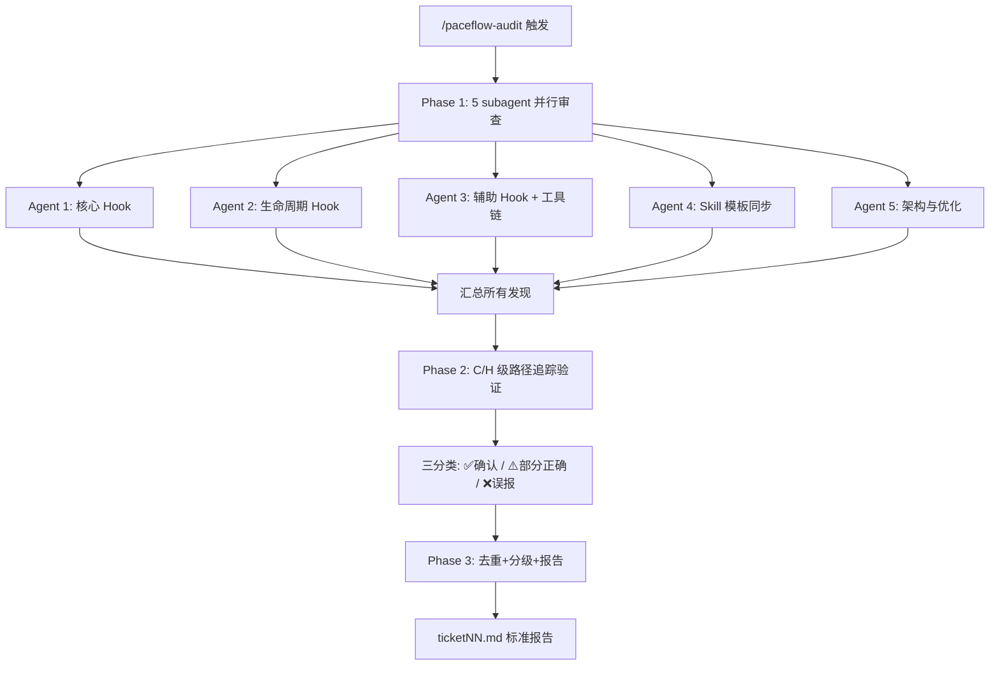

# PACEflow 全面审查

## 触发场景

- 用户说"完整分析"、"全面审查"、"全面检查"
- 用户调用 `/paceflow-audit`
- 版本发布前的质量门控

## 审查范围

> Agent 必须**动态发现**文件，不依赖预设数量。使用 Glob 扫描。

| 类别 | Glob 模式 |
|------|-----------|
| Hook 脚本 | `paceflow/hooks/*.js` |
| Skill 定义 | `paceflow/skills/*/SKILL.md` |
| Skill 引用 | `paceflow/skills/*/references/*.md` |
| Hook 模板 | `paceflow/hooks/templates/*.md` |
| Skill 模板 | `paceflow/skills/*/templates/*.md` |
| Agent | `paceflow/agents/**/*.md` |
| 配置 | `paceflow/hooks/hooks.json` |
| Plugin 元数据 | `paceflow/.claude-plugin/plugin.json` + `paceflow/.claude-plugin/marketplace.json` |
| 本地工具 | `paceflow/install.js` + `paceflow/verify.js`（仅本地验证，不是正式安装路径） |
| 测试 | `paceflow/tests/**/*.js` + `paceflow/tests/agent-tests/**/*.yaml` |
| 文档 | `CLAUDE.md` + `paceflow/README.md` + `paceflow/REFERENCE.md` |

---

## 严重度标准

| 级别 | 定义 | C 级门槛 |
|------|------|---------|
| **C** Critical | 功能错误、数据丢失、流程阻塞 | 必须证明**具体触发路径** |
| **H** High | 影响可靠性但不阻塞 | — |
| **W** Warning | 代码质量、文档过时 | — |
| **I** Info | 优化建议、风格改进 | — |

每个发现必须包含：文件名:行号、问题描述、建议修复。

---

## Phase 1：五维度并行审查

启动 5 个 subagent **并行**执行（Agent 工具，subagent_type: `general-purpose`）。

| Agent | 审查目标 | 关注维度 |
|-------|---------|---------|
| 1. 代码质量 | 核心 Hook（公共模块 + Write/Edit hook） | Bug/正则/路径/异常/I/O 协议 |
| 2. 流程完整性 | 生命周期 Hook（SessionStart/Stop/PreCompact） | stdin 解析/防循环/快照/降级 |
| 3. 一致性 | 辅助 Hook + Plugin + Agent 发布资产 | hooks.json/plugin/agents 一致性 |
| 4. Skill 模板 | 所有 Skill + 模板 | v6 口径/交叉引用/格式/正则兼容 |
| 5. 架构优化 | 测试 + 文档 + 整体架构 | agent contract 覆盖度/文档准确性/流程缺口 |

> 每个 agent 的完整 prompt 和共享审查纪律见 [references/agent-prompts.md](references/agent-prompts.md)。

---

## Phase 2：验证筛选

> 历史误报率 50-80%，验证是流程核心。

对 **C/H 级**发现启动验证 subagent：

| 验证方法 | 适用场景 |
|---------|---------|
| 路径追踪 | 逻辑错误 — 从问题行追踪到入口确认可达 |
| 实际 diff | 不一致声称 — 逐行对比两个文件 |
| 设计意图查证 | 可能有意设计 — 检查 CLAUDE.md + 注释 |
| 最小复现 | 可构造触发条件 — E2E 测试验证 |

结果三分类：✅ 确认 / ⚠️ 部分正确 / ❌ 误报

W/I 级快速扫描去重合并，不逐一验证。

---

## Phase 3：汇总报告

1. **去重**：同文件+同行号+同性质 → 合并
2. **分级**：P0 必修（C+高影响H）→ P1 建议（W）→ P2 文档 → P3 延后（I → 派 `record-finding`）
3. **建议后续变更**：每个 P0/P1 问题推荐对应 CHG-ID 或归入现有 CHG
4. **审查输入版本记录**：记录本次审查读取的 artifact 文件最后修改时间戳
5. **生成 ticketNN.md**

> 报告模板和误报防御策略见 [references/audit-procedures.md](references/audit-procedures.md)。

---

## 快速参考

