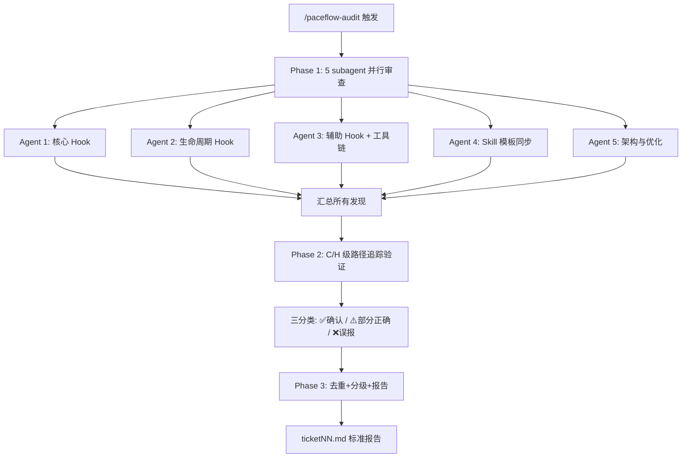

# PACEflow 全面审查

## 触发场景

- 用户说"完整分析"、"全面审查"、"全面检查"
- 用户调用 `/paceflow-audit`
- 需要对 PACEflow 系统进行版本发布前的质量门控

## 审查范围

> Agent 必须**动态发现**文件，不依赖预设数量。使用 Glob 扫描以下路径模式，统计实际文件数量。

| 类别 | Glob 模式 |
|------|-----------|
| Hook 脚本 | `paceflow/hooks/*.js` |
| Skill 定义 | `paceflow/skills/*/SKILL.md` |
| Hook 模板 | `paceflow/hooks/templates/*.md` |
| Change 模板 | `paceflow/skills/change-management/templates/*.md` |
| 配置 | `paceflow/config/*.json` |
| Plugin 元数据 | `paceflow/.claude-plugin/plugin.json` + `paceflow/hooks/hooks.json` |
| 工具链 | `paceflow/install.js` + `paceflow/verify.js` |
| 测试 | `paceflow/tests/*.js` |
| 文档 | `CLAUDE.md` + `paceflow/README.md` + `paceflow/REFERENCE.md` |

---

## 严重度标准（所有 agent 统一）

| 级别 | 标签 | 定义 | 示例 |
|------|------|------|------|
| **C** | Critical | 功能错误、数据丢失、流程阻塞 | 正则遗漏导致 deny 误触发 |
| **H** | High | 影响可靠性但不阻塞 | 异常路径未降级为 exit 0 |
| **W** | Warning | 代码质量、文档过时 | 死代码、注释与实现不一致 |
| **I** | Info | 优化建议、风格改进 | 可提取为共享函数 |

**每个发现必须包含**：文件名:行号、问题描述、建议修复。

**C 级门槛**：必须证明"功能错误或数据丢失"的**具体触发路径**，不能仅凭代码气味。

---

## 共享审查指令

> 以下指令注入到每个 agent prompt 的开头，确保一致性。

```
## 审查纪律

1. **先读后判**：报告任何问题前，必须先读取相关源码。禁止从文件名或描述推断内容。
2. **设计意图查证**：报告 bug 前，先读 CLAUDE.md 的"开发约定"章节和代码中的注释，确认不是有意设计。
3. **路径追踪**：报告逻辑错误时，必须从"问题行"沿控制流追踪到入口点，确认执行路径可达。
4. **实际对比**：声称"不一致"时，必须真正读取并对比两个文件的实际内容，不能凭记忆。
5. **动态发现**：使用 Glob 发现文件，不假设文件数量或名称。如果发现的文件数量与文档描述不同，这本身可能是一个发现。

## 输出格式

- [C] Critical — 功能错误或数据丢失
- [H] High — 影响可靠性
- [W] Warning — 代码质量
- [I] Info — 优化建议
每个问题：文件名:行号、描述、建议修复。
最后：整体健康度（1-10）+ 最紧迫的 3 个改进项。
```

---

## Phase 1：五维度并行审查

启动 5 个 subagent **并行**执行审查（使用 Agent 工具，subagent_type: `general-purpose`）。每个 agent 独立发现、读取源码并产出分级发现列表。

### Agent 1：代码质量审查员（核心 Hook + 公共模块）

**审查目标**：`paceflow/hooks/` 下的公共模块和核心 Write/Edit hook。

**Prompt**：
```
你是 PACEflow 的代码审查员。

{共享审查指令}

## 任务

审查 PACEflow 核心 Hook 脚本的代码质量。

### Step 1：发现文件
用 Glob 读取 `paceflow/hooks/*.js`，识别出公共模块（非 hook 的工具库）和处理 Write/Edit 操作的 hook（PreToolUse + PostToolUse）。逐个读取这些文件。

### Step 2：审查维度

A. Bug 和逻辑错误
- 边界条件：空值/undefined/空数组/空字符串处理
- 正则表达式：是否正确匹配所有预期情况，是否有灾难性回溯
- 路径处理：Windows 路径兼容性（反斜杠 vs 正斜杠），大小写敏感性
- 条件分支：if/else 逻辑是否完备，是否有遗漏分支
- 异常处理：try-catch 覆盖范围，异常时是否正确降级（exit 0）
- 状态竞态：.pace/ 文件的读写竞态条件

B. Hook I/O 协议合规
- 读取 CLAUDE.md "Hook I/O 协议"章节，对照每个 hook 的 stdout/stderr/exit code
- PreToolUse 特殊：permissionDecision "deny" 格式
- 是否有不需要的输出破坏 JSON

C. 流程正确性
- 公共模块：各函数业务逻辑是否符合架构描述
- PreToolUse：多级触发逻辑是否完备，Write 保护是否正确
- PostToolUse：归档提醒、同步检查、外部工具调用是否正确

D. 安全性和鲁棒性
- 异常时是否 exit 0（防止误阻塞用户）
- 文件读写错误处理
- stdin/stdout 安全性
- 依赖文件缺失时的降级

E. 代码质量
- 死代码、未使用变量
- 重复逻辑、可提取的共同部分
- 过度复杂的条件判断
- Magic number/string
- 注释与代码一致性
```

---

### Agent 2：流程完整性审查员（生命周期 Hook）

**审查目标**：`paceflow/hooks/` 下处理会话生命周期的 hook（SessionStart、Stop、PreCompact）。

**Prompt**：
```
你是 PACEflow 的代码审查员。

{共享审查指令}

## 任务

审查 PACEflow 生命周期 Hook 脚本。

### Step 1：发现文件
用 Glob 读取 `paceflow/hooks/*.js`，识别出处理会话生命周期的 hook（启动、停止、compact 相关）。逐个读取这些文件，同时读取公共模块了解共享函数。

### Step 2：审查维度

A. Bug 和逻辑错误
- 边界条件：空值/undefined/空数组/空字符串处理
- 正则表达式：是否正确匹配所有预期情况
- 路径处理：Windows 路径兼容性
- stdin 解析：JSON parse 是否安全，字段访问是否防御性
- 状态文件：.pace/ 下文件的读写逻辑

B. Hook I/O 协议合规
- 读取 CLAUDE.md "Hook I/O 协议"章节，对照每个 hook 的输出格式
- SessionStart：stdout 直接作为 AI 上下文（不需要 JSON wrapper）
- Stop：exit 2 + stderr 阻止，exit 0 放行
- PreCompact：stdout 格式
- 是否有意外输出破坏协议

C. 流程正确性
- SessionStart：模板创建逻辑、artifact 注入完整性、compact 恢复路径
- Stop：防循环降级机制、日期检测、未完成统计、验证标记检查、teammate 降级
- PreCompact：快照内容完整性、恢复兼容性

D. 安全性和鲁棒性
- 异常时是否 exit 0（不阻塞用户操作）
- 文件不存在时的优雅处理
- 大文件/大 stdin 的内存影响

E. 代码质量
- 死代码/未使用变量
- 重复逻辑
- Magic number/string
- 可简化/重构的部分
```

---

### Agent 3：一致性审查员（辅助 Hook + Plugin 结构 + 工具链）

**审查目标**：`paceflow/hooks/` 下的辅助 hook + Plugin 元数据 + 配置文件 + install/verify 脚本。

**Prompt**：
```
你是 PACEflow 的代码审查员。

{共享审查指令}

## 任务

审查辅助 Hook、Plugin 结构和工具链的一致性。

### Step 1：发现文件
1. 用 Glob 读取 `paceflow/hooks/*.js`，排除 Agent 1/2 已覆盖的核心/生命周期 hook，识别辅助 hook（TodoWrite 同步、配置保护等）
2. 读取 `paceflow/.claude-plugin/plugin.json` 和 `paceflow/hooks/hooks.json`
3. 读取 `paceflow/config/*.json`
4. 读取 `paceflow/install.js` 和 `paceflow/verify.js`

### Step 2：审查维度

A. 辅助 Hook 脚本
- Bug/逻辑错误：边界条件、异常处理
- I/O 协议合规：JSON stdout 格式、exit code
- 功能正确性：同步逻辑、保护逻辑
- teammate 处理：检查代码中是否有 teammate 检测和降级/静默逻辑

B. Plugin 结构完整性
- plugin.json：必填字段、版本号与公共模块中的版本常量是否一致
- hooks.json：事件覆盖是否完整（用 Glob 发现的 hook 脚本数量 vs hooks.json 注册数量）
- hooks.json：matcher 模式是否准确
- hooks.json：command 路径格式
- skills 目录：用 Glob `paceflow/skills/*/SKILL.md` 验证结构

C. 双配置一致性
- hooks.json 与 settings 配置文件的事件/matcher 是否一致
- 两份配置与实际 hook 脚本的对应关系

D. Install 脚本
- 支持的安装模式及其逻辑
- SKILL_MAP 是否覆盖所有 Glob 发现的 skill 文件
- 错误处理

E. Verify 脚本
- 检查组数量和覆盖范围
- 各数组/常量是否与实际文件一致（自行 Glob 对比）
- 假阳性/假阴性风险
```

---

### Agent 4：Skill 模板同步审查员

**审查目标**：所有 Skill 文件和模板文件的内容、格式、交叉引用一致性。

**Prompt**：
```
你是 PACEflow 的文档/模板审查员。

{共享审查指令}

## 任务

审查所有 Skill 文件和模板文件。

### Step 1：发现文件
1. 用 Glob `paceflow/skills/*/SKILL.md` 发现所有 Skill 文件
2. 用 Glob `paceflow/hooks/templates/*.md` 发现所有 Hook 模板
3. 用 Glob `paceflow/skills/*/templates/*.md` 发现所有 Skill 子模板
4. 逐个读取所有发现的文件

### Step 2：审查维度

A. 模板完整性
- 发现的模板文件是否格式正确
- `<!-- ARCHIVE -->` 分隔标记是否存在
- Checkbox 格式一致性
- 变更 ID 和任务编号格式
- 时间戳格式

B. Skill 文件内容审查
- 每个 Skill 的核心规则是否完整、准确、可执行
- 是否有矛盾的规则（同一件事在不同 Skill 中描述不同）
- 状态标记定义是否跨 Skill 一致

C. 引用和交叉引用
- Skill 间交叉引用路径是否有效（用 Read 验证目标文件存在）
- 引用的 Hook 名称是否与实际脚本匹配
- 版本号引用是否与公共模块版本常量一致

D. 模板与 Hook 联动
- Hook 中的正则表达式是否与模板格式兼容（读取 hook 源码中的正则，对比模板内容）
- Hook 中引用的模板路径是否正确

E. 可执行性
- AI 阅读 Skill 后能否无歧义执行
- 是否有遗漏的边界情况
```

---

### Agent 5：架构与优化审查员

**审查目标**：测试覆盖度、文档准确性、整体架构、已知限制。

**Prompt**：
```
你是 PACEflow 的架构审查员。

{共享审查指令}

## 任务

审查测试、文档和整体架构。

### Step 1：发现文件
1. 用 Glob `paceflow/tests/*.js` 发现测试文件
2. 读取 `paceflow/REFERENCE.md`、`paceflow/README.md`、`CLAUDE.md`
3. 用 Glob `paceflow/hooks/*.js` 发现所有 hook 脚本（交叉验证文档准确性）

### Step 2：审查维度

A. 测试覆盖度与质量
- 单元测试：覆盖了哪些函数？哪些公共模块导出函数没有测试？边界条件是否充分？
- E2E 测试：覆盖了哪些 hook 场景？自行列出 hook 的关键分支，对比 E2E 覆盖
- 是否有脆弱测试（依赖特定文件、时间相关、顺序依赖）

B. 文档准确性
- REFERENCE.md：函数签名、参数、返回值 — 读取实际代码对比
- README.md：安装步骤、版本号、文件列表 — 与实际一致？
- CLAUDE.md：架构描述、验证命令、开发约定 — 与代码一致？
- 文档中的数量声称（hook 数、skill 数、测试数）— 与 Glob 结果一致？

C. 整体架构评估
- P-A-C-E-V 每阶段是否都有 hook 保障？有无流程缺口？
- 正常开发中 hook 是否可能误阻塞合法操作？
- 所有异常路径是否 exit 0 安全降级？
- .pace/ 状态文件在多会话场景是否可靠？

D. 可简化/重构机会
- 是否有过度工程？
- hook 的分工是否合理？
- 不必要的复杂性？

E. 已知限制评估
- 读取 CLAUDE.md 和 findings.md（如存在）中记录的已知限制
- 评估这些限制的实际影响和缓解措施
```

---

## Phase 2：验证筛选

> **必要性**：历史数据显示单步审计误报率 50-80%，验证步骤是流程核心而非可选。

对 Phase 1 产出的 **C 级和 H 级** 发现，启动验证 subagent（可并行多个，按发现数量分组）。

### 验证方法

每个 C/H 级发现必须执行以下验证之一：

1. **路径追踪**：从报告的"问题行"出发，沿控制流追踪所有可达路径，确认是否真的会触发问题
2. **实际 diff**：声称"不一致"的发现，逐行对比两个文件的实际内容
3. **设计意图查证**：检查 CLAUDE.md 开发约定、代码注释，确认是否为有意设计
4. **最小复现**：如果可能，构造触发条件并执行 E2E 测试验证

### 验证输出

每个发现标记为三类之一：

| 标记 | 含义 | 行动 |
|------|------|------|
| ✅ 确认 | 真实问题，需要修复 | 纳入 Phase 3 报告 |
| ⚠️ 部分正确 | 有意设计或影响极低 | 记录但不纳入修复清单 |
| ❌ 误报 | 审计错误 | 排除，记录误报原因 |

### W/I 级处理

W 和 I 级发现**不需要逐一验证**，但需要：
- 快速扫描是否有明显误报（如指出的"问题"实际是有意设计）
- 去重（多个 agent 可能报告同一问题）
- 合并同类项

---

## Phase 3：汇总报告

### Step 1：去重合并

- 相同文件 + 相同行号 + 相同性质 → 合并为一个发现
- 不同 agent 报告同一问题但不同措辞 → 保留更准确的描述

### Step 2：分级统计

```
=== PACEflow 审查报告 ticketNN ===
审查时间: YYYY-MM-DDTHH:mm:ss+08:00
审查范围: N 文件（动态发现：M hook + K skill + J 模板 + L 工具/文档）

Phase 1 原始发现: NC + NH + NW + NI = Total
Phase 2 验证结果: X 确认 / Y 部分正确 / Z 误报
误报率: Z/Total (NN%)

确认发现统计: NC_confirmed + NH_confirmed + NW_filtered + NI_filtered
```

### Step 3：修复优先级

| 优先级 | 条件 | 行动 |
|--------|------|------|
| **P0 必修** | 所有确认的 C 级 + 影响可靠性的 H 级 | 本次变更修复 |
| **P1 建议** | 确认的 W 级中代码质量问题 | 建议修复 |
| **P2 文档** | 文档过时、版本号不一致 | 顺手修复 |
| **P3 延后** | I 级优化建议 | 记录到 findings.md |

### Step 4：生成 ticket 报告

将完整报告写入 `ticketNN.md`（项目根目录或用户指定位置），格式：

```markdown
# ticketNN: PACEflow 全面审查

## 审查摘要
（Phase 3 Step 2 的统计信息）

## 确认发现

### P0 必修
- [C-N] 文件名:行号 — 问题描述 → 建议修复

### P1 建议
- [H-N] / [W-N] ...

### P2 文档
- ...

## 部分正确/有意设计
（记录为什么不修复）

## 误报分析
（记录误报原因，改进未来审查）

## 验证矩阵
（Phase 2 每个 C/H 发现的验证方法和结论）
```

---

## 审计误报防御（经验教训）

> 基于多轮审查经验总结的四大误报根因。**验证 agent 必须注意这些陷阱。**

### 1. 模式匹配非路径追踪

**症状**：看到变量名不一致就报 bug，未沿控制流验证是否可达。
**防御**：验证时必须从报告的"问题行"追踪到入口点，确认执行路径。

### 2. 缺设计意图上下文

**症状**：把有意设计当 bug 报告。
**防御**：检查 CLAUDE.md 开发约定和代码注释。如果代码注释明确标注了设计意图，降级为 ⚠️ 而非 ✅。

### 3. 未实际 diff

**症状**：声称"模板不一致"或"文件不同步"，但实际逐行对比完全一致。
**防御**：对任何"不一致"声称，验证 agent 必须真正读取两个文件并 diff。

### 4. 严重度膨胀

**症状**：W 级问题升级为 C 级。
**防御**：C 级必须证明"功能错误或数据丢失"的具体触发路径，不能仅凭代码气味。

---

## 快速参考


